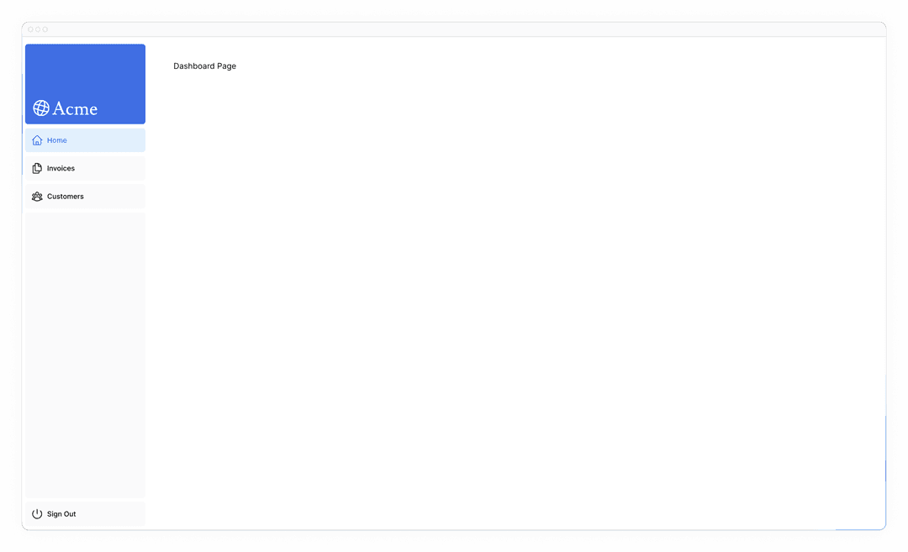
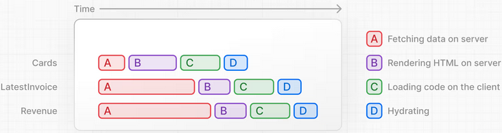

# Introduction

## What we'll be building


For this course, we'll build a financial dashboard that has:

* A public home page.
* A login page.
* Dashboard pages that are protected by authentication.
* The ability for users to add, edit, and delete invoices.

The dashboard will also have an accompanying database, which you'll set up in a later chapter.

By the end of the course, you'll have the essential skills needed to start building full-stack Next.js applications.

## Overview

Here's an overview of features you'll learn about in this course:

* Styling: The different ways to style your application in Next.js.
* Optimizations: How to optimize images, links, and fonts.
* Routing: How to create nested layouts and pages using file-system routing.
* Data Fetching: How to set up a Postgres database on Vercel, and best practices for fetching and streaming.
* Search and Pagination: How to implement search and pagination using URL search params.
* Mutating Data: How to mutate data using React Server Actions, and revalidate the Next.js cache.
* Error Handling: How to handle general and `404` not found errors.
* Form Validation and Accessibility: How to do server-side form validation and tips for improving accessibility.
* Authentication: How to add authentication to your application using `NextAuth.js` and Middleware.
Metadata: How to add metadata and prepare your application for social sharing.


# Chapter 1: Getting Started

We recommend using `pnpm` as your package manager, as it's faster and more efficient than `npm` or `yarn`. If you don't have `pnpm` installed, you can install it globally by running:
```bash
npx create-next-app@latest nextjs-dashboard --example "https://github.com/vercel/next-learn/tree/main/dashboard/starter-example" --use-pnpm
```

This command uses `create-next-app`, a Command Line Interface (CLI) tool that sets up a Next.js application for you. In the command above, you're also using the `--example` flag with the starter example for this course.

Our goal is to help you focus on learning the main features of Next.js, without having to write all the application code.

## Folder structure


* `/app`: Contains all the routes, components, and logic for your application, this is where you'll be mostly working from.
* `/app/lib`: Contains functions used in your application, such as reusable utility functions and data fetching functions.
* `/app/ui`: Contains all the UI components for your application, such as cards, tables, and forms. To save time, we've pre-styled these components for you.
* `/public`: Contains all the static assets for your application, such as images.
* Config Files: You'll also notice config files such as `next.config.ts` at the root of your application. Most of these files are created and pre-configured when you start a new project using `create-next-app`. You will not need to modify them in this course.

## Placeholder data

When you're building user interfaces, it helps to have some placeholder data. If a database or API is not yet available, you can:

* Use placeholder data in JSON format or as JavaScript objects.
* Use a 3rd party service like mockAPI.

For this project, we've provided some placeholder data in `app/lib/placeholder-data.ts`. Each JavaScript object in the file represents a table in your database. For example, for the invoices table:
```ts
// /app/lib/placeholder-data.ts
const invoices = [
  {
    customer_id: customers[0].id,
    amount: 15795,
    status: 'pending',
    date: '2022-12-06',
  },
  {
    customer_id: customers[1].id,
    amount: 20348,
    status: 'pending',
    date: '2022-11-14',
  },
  // ...
];
```

In the chapter on setting up your database, you'll use this data to seed your database (populate it with some initial data).

## TypeScript

You may also notice most files have a `.ts` or `.tsx` suffix. This is because the project is written in TypeScript. We wanted to create a course that reflects the modern web landscape.

For now, take a look at the `/app/lib/definitions.ts` file. Here, we manually define the types that will be returned from the database. For example, the invoices table has the following types:
```ts
// /app/lib/definitions.ts
export type Invoice = {
  id: string;
  customer_id: string;
  amount: number;
  date: string;
  // In TypeScript, this is called a string union type.
  // It means that the "status" property can only be one of the two strings: 'pending' or 'paid'.
  status: 'pending' | 'paid';
};
```

By using TypeScript, you can ensure you don't accidentally pass the wrong data format to your components or database, like passing a `string` instead of a `number` to invoice `amount`.

## Running the development server

Run `pnpm i` to install the project's packages.
```bash
pnpm i
```

Followed by `pnpm dev` to start the development server.
```bash
pnpm dev
```

Open `http://localhost:3000` on your browser. Your home page should look like this, which is intentionally unstyled:


# Chapter 2: CSS Styling

## Global styles

If you look inside the `/app/ui` folder, you'll see a file called `global.css`. You can use this file to add CSS rules to **all** the routes in your application - such as CSS reset rules, site-wide styles for HTML elements like links, and more.

You can import `global.css` in any component in your application, but it's usually good practice to add it to your top-level component.

Add global styles to your application by navigating to `/app/layout.tsx` and importing the `global.css` file:
```ts
// /app/layout.tsx
import '@/app/ui/global.css';

export default function RootLayout({
  children,
}: {
  children: React.ReactNode;
}) {
  return (
    <html lang="en">
      <body>{children}</body>
    </html>
  );
}
```

Your home page should now look like this:


But wait a second, you didn't add any CSS rules, where did the styles come from?

If you take a look inside `global.css`, you'll notice some `@tailwind` directives:
```css
/* /app/ui/global.css */
@tailwind base;
@tailwind components;
@tailwind utilities;
```

## Tailwind

Tailwind is a CSS framework that speeds up the development process by allowing you to quickly write utility classes directly in your React code.

In Tailwind, you style elements by adding class names. For example, adding `"text-blue-500"` will turn the `<h1>` text blue:
```html
<h1 className="text-blue-500">I'm blue!</h1>
```

Although the CSS styles are shared globally, each class is singularly applied to each element. This means if you add or delete an element, you don't have to worry about maintaining separate stylesheets, style collisions, or the size of your CSS bundle growing as your application scales.

When you use `create-next-app` to start a new project, Next.js will ask if you want to use Tailwind. If you select `yes`, Next.js will automatically install the necessary packages and configure Tailwind in your application.

If you look at `/app/page.tsx`, you'll see that we're using Tailwind classes in the example.
```ts
import AcmeLogo from '@/app/ui/acme-logo';
import { ArrowRightIcon } from '@heroicons/react/24/outline';
import Link from 'next/link';

export default function Page() {
  return (
    // These are Tailwind classes:
    <main className="flex min-h-screen flex-col p-6">
      <div className="flex h-20 shrink-0 items-end rounded-lg bg-blue-500 p-4 md:h-52">
    // ...
  )
}
```

Let's play with Tailwind! Copy the code below and paste it above the `<p>` element in `/app/page.tsx`:
```ts
<div
  className="relative w-0 h-0 border-l-[15px] border-r-[15px] border-b-[26px] border-l-transparent border-r-transparent border-b-black"
/>
```

If you prefer writing traditional CSS rules or keeping your styles separate from your JSX - CSS Modules are a great alternative.

## CSS Modules

CSS Modules allow you to scope CSS to a component by automatically creating unique class names, so you don't have to worry about style collisions as well.

We'll continue using Tailwind in this course, but let's take a moment to see how you can achieve the same results from the quiz above using CSS modules.

Inside `/app/ui`, create a new file called `home.module.css` and add the following CSS rules:
```css
/* /app/ui/home.module.css */
.shape {
  height: 0;
  width: 0;
  border-bottom: 30px solid black;
  border-left: 20px solid transparent;
  border-right: 20px solid transparent;
}
```

Then, inside your `/app/page.tsx` file import the styles and replace the Tailwind class names from the `<div>` you've added with `styles.shape`:
```js
// /app/page.tsx
import AcmeLogo from '@/app/ui/acme-logo';
import { ArrowRightIcon } from '@heroicons/react/24/outline';
import Link from 'next/link';
import styles from '@/app/ui/home.module.css';      // ++

export default function Page() {
  return (
    <main className="flex min-h-screen flex-col p-6">
      <div className={styles.shape} />            <!-- ++ -->
    // ...
  )
}
```

Tailwind and CSS modules are the two most common ways of styling Next.js applications. Whether you use one or the other is a matter of preference - you can even use both in the same application!

## Using the `clsx` library to toggle class names

There may be cases where you may need to conditionally style an element based on state or some other condition.

`clsx` is a library that lets you toggle class names easily. Here's the basic usage:

* Suppose that you want to create an `InvoiceStatus` component which accepts `status`. The status can be `'pending'` or `'paid'`.
* If it's `'paid'`, you want the color to be green. If it's `'pending'`, you want the color to be gray.

You can use `clsx` to conditionally apply the classes, like this:
```js
// /app/ui/invoices/status.tsx
import clsx from 'clsx';

export default function InvoiceStatus({ status }: { status: string }) {
  return (
    <span
      className={clsx(
        'inline-flex items-center rounded-full px-2 py-1 text-sm',
        {
          'bg-gray-100 text-gray-500': status === 'pending',
          'bg-green-500 text-white': status === 'paid',
        },
      )}
    >
    // ...
)}
```

### Other styling solutions

In addition to the approaches we've discussed, you can also style your Next.js application with:

* Sass which allows you to import .css and .scss files.
* CSS-in-JS libraries such as styled-jsx, styled-components, and emotion.

Take a look at the CSS documentation for more information.


# Chapter 3: Optimizing Fonts and Images

## Why optimize fonts?

Fonts play a significant role in the design of a website, but using custom fonts in your project can affect performance if the font files need to be fetched and loaded.

Cumulative Layout Shift is a metric used by Google to evaluate the performance and user experience of a website. With fonts, layout shift happens when the browser initially renders text in a fallback or system font and then swaps it out for a custom font once it has loaded. This swap can cause the text size, spacing, or layout to change, shifting elements around it.

Next.js automatically optimizes fonts in the application when you use the next/font module. It downloads font files at build time and hosts them with your other static assets. This means when a user visits your application, there are no additional network requests for fonts which would impact performance.

## Adding a primary font

In your `/app/ui` folder, create a new file called `fonts.ts`. You'll use this file to keep the fonts that will be used throughout your application.

Import the `Inter` font from the `next/font/google` module - this will be your primary font. Then, specify what subset you'd like to load. In this case, `'latin'`:

Finally, add the font to the `<body>` element in `/app/layout.tsx`:
```js
// /app/layout.tsx
import '@/app/ui/global.css';
import { inter } from '@/app/ui/fonts';                                     // ++

export default function RootLayout({
  children,
}: {
  children: React.ReactNode;
}) {
  return (
    <html lang="en">
      <body className={`${inter.className} antialiased`}>{children}</body>  <!--++-->
    </html>
  );
}
```

By adding `Inter` to the `<body>` element, the font will be applied throughout your application. Here, you're also adding the Tailwind `antialiased` class which smooths out the font. It's not necessary to use this class, but it adds a nice touch.

## Practice: Adding a secondary font

You can also add fonts to specific elements of your application.

Now it's your turn! In your `fonts.ts` file, import a secondary font called `Lusitana` and pass it to the `<p>` element in your `/app/page.tsx` file. In addition to specifying a subset like you did before, you should also specify different font weights. For example, `400` (normal) and `700` (bold).

**done!**

Next, let's add a hero image to the home page.

## Why optimize images?

Next.js can serve static assets, like images, under the top-level `/public` folder. Files inside `/public` can be referenced in your application.

With regular HTML, you would add an image as follows:
```html

```

However, this means you have to manually:
* Ensure your image is responsive on different screen sizes.
* Specify image sizes for different devices.
* Prevent layout shift as the images load.
* Lazy load images that are outside the user's viewport.

Image Optimization is a large topic in web development that could be considered a specialization in itself. Instead of manually implementing these optimizations, you can use the `next/image` component to automatically optimize your images.


## The `<Image>` component

The `<Image>` Component is an extension of the HTML `` tag, and comes with automatic image optimization, such as:
* Preventing layout shift automatically when images are loading.
* Resizing images to avoid shipping large images to devices with a smaller viewport.
* Lazy loading images by default (images load as they enter the viewport).
* Serving images in modern formats, like WebP and AVIF, when the browser supports it.

## Adding the desktop hero image

Let's use the `<Image>` component. If you look inside the `/public` folder, you'll see there are two images: `hero-desktop.png` and `hero-mobile.png`. These two images are completely different, and they'll be shown depending if the user's device is a desktop or mobile.

In your `/app/page.tsx` file, import the component from `next/image`. Then, add the image under the comment:
```js
// /app/page.tsx
import AcmeLogo from '@/app/ui/acme-logo';
import { ArrowRightIcon } from '@heroicons/react/24/outline';
import Link from 'next/link';
import { lusitana } from '@/app/ui/fonts';
import Image from 'next/image';                                          // ++

export default function Page() {
  return (
    // ...
    <div className="flex items-center justify-center p-6 md:w-3/5 md:px-28 md:py-12">
      {/* Add Hero Images Here */}
      <Image
        src="/hero-desktop.png"
        width={1000}
        height={760}
        className="hidden md:block"
        alt="Screenshots of the dashboard project showing desktop version"
      />
    </div>
    //...
  );
}
```

Here, you're setting the width to 1000 and height to 760 pixels. It's good practice to set the width and height of your images to avoid layout shift, these should be an aspect ratio **identical** to the source image. These values are not the size the image is rendered, but instead the size of the actual image file used to understand the aspect ratio.

You'll also notice the class `hidden` to remove the image from the DOM on mobile screens, and `md:block` to show the image on desktop screens.

## Practice: Adding the mobile hero image

Now it's your turn! Under the image you've just added, add another `<Image>` component for `hero-mobile.png`.
* The image should have a width of 560 and height of 620 pixels.
* It should be shown on mobile screens, and hidden on desktop - you can use dev tools to check if the desktop and mobile images are swapped correctly.

## Recommended reading

* <a href="https://nextjs.org/docs/app/building-your-application/optimizing/images" rel="noopener noreferrer nofollow" target="_blank">Image Optimization Docs</a>
* <a href="https://nextjs.org/docs/app/building-your-application/optimizing/fonts" rel="noopener noreferrer nofollow" target="_blank">Font Optimization Docs</a>
* <a href="https://developer.mozilla.org/en-US/docs/Learn/Performance/Multimedia" rel="noopener noreferrer nofollow" target="_blank">Improving Web Performance with Images (MDN)</a>
* <a href="https://developer.mozilla.org/en-US/docs/Learn/CSS/Styling_text/Web_fonts" rel="noopener noreferrer nofollow" target="_blank">Web Fonts (MDN)</a>
* <a href="https://vercel.com/blog/how-core-web-vitals-affect-seo" rel="noopener noreferrer" target="_blank">How Core Web Vitals Affect SEO</a>
* <a href="https://vercel.com/blog/how-google-handles-javascript-throughout-the-indexing-process" rel="noopener noreferrer" target="_blank">How Google handles JavaScript throughout the indexing process</a>

# Chapter 4: Creating Layouts and Pages

Next.js uses file-system routing where folders are used to create nested routes. Each folder represents a route segment that maps to a URL segment.


You can create separate UIs for each route using `layout.tsx` and `page.tsx` files.

`page.tsx` is a special Next.js file that exports a React component, and it's required for the route to be accessible. In your application, you already have a page file: `/app/page.tsx` - this is the home page associated with the route `/`.

To create a nested route, you can nest folders inside each other and add `page.tsx` files inside them. For example:


`/app/dashboard/page.tsx` is associated with the `/dashboard` path.

## Creating the dashboard page

Create a new folder called `dashboard` inside `/app`. Then, create a new `page.tsx` file inside the `dashboard` folder with the following content:
```js
// /app/dashboard/page.tsx
export default function Page() {
  return <p>Dashboard Page</p>;
}
```

Visit http://localhost:3000/dashboard.

By having a special name for `page` files, Next.js allows you to colocate UI components, test files, and other related code with your routes. Only the content inside the `page` file will be publicly accessible. For example, the `/ui` and `/lib` folders are colocated inside the `/app` folder along with your routes.

## Creating the dashboard layout

Dashboards have some sort of navigation that is shared across multiple pages. In Next.js, you can use a special `layout.tsx` file to create UI that is shared between multiple pages. Let's create a layout for the dashboard pages!

Inside the `/dashboard` folder, add a new file called `layout.tsx` and paste the following code:
```js
// /app/dashboard/layout.tsx
import SideNav from '@/app/ui/dashboard/sidenav';

export default function Layout({ children }: { children: React.ReactNode }) {
  return (
    <div className="flex h-screen flex-col md:flex-row md:overflow-hidden">
      <div className="w-full flex-none md:w-64">
        <SideNav />
      </div>
      <div className="flex-grow p-6 md:overflow-y-auto md:p-12">{children}</div>
    </div>
  );
}
```

The `<Layout />` component receives a `children` prop. This child can either be a page or another layout. In your case, the pages inside `/dashboard` will automatically be nested inside a `<Layout />` like so:




One benefit of using layouts in Next.js is that on navigation, only the page components update while the layout won't re-render. This is called partial rendering which preserves client-side React state in the layout when transitioning between pages.

## Root layout

In Chapter 3, you imported the `Inter` font into another layout: `/app/layout.tsx`. As a reminder:
```js
// /app/layout.tsx
import '@/app/ui/global.css';
import { inter } from '@/app/ui/fonts';

export default function RootLayout({
  children,
}: {
  children: React.ReactNode;
}) {
  return (
    <html lang="en">
      <body className={`${inter.className} antialiased`}>{children}</body>
    </html>
  );
}
```

This is called a root layout and is required in every Next.js application. Any UI you add to the root layout will be shared across all pages in your application. You can use the root layout to modify your `<html>` and `<body>` tags, and add metadata.

Since the new layout you've just created (`/app/dashboard/layout.tsx`) is unique to the dashboard pages, you don't need to add any UI to the root layout above.


# Chapter 5: Navigating Between Pages

## Why optimize navigation?

To link between pages, you'd traditionally use the `<a>` HTML element. At the moment, the sidebar links use `<a>` elements, but notice what happens when you navigate between the home, invoices, and customers pages on your browser.

There's a full page refresh on each page navigation!

## The `<Link>` component

`<Link>` allows you to do client-side navigation with JavaScript.

To use the `<Link />` component, open `/app/ui/dashboard/nav-links.tsx`, and import the `Link` component from `next/link`. Then, replace the `<a>` tag with `<Link>`:
```js
// /app/ui/dashboard/nav-links.tsx
import {
  UserGroupIcon,
  HomeIcon,
  DocumentDuplicateIcon,
} from '@heroicons/react/24/outline';
import Link from 'next/link';               /* ++ */

// ...

export default function NavLinks() {
  return (
    <>
      {links.map((link) => {
        const LinkIcon = link.icon;
        return (
          <Link                             {/* ++ */}
            key={link.name}
            href={link.href}
            className="flex h-[48px] grow items-center justify-center gap-2 rounded-md bg-gray-50 p-3 text-sm font-medium hover:bg-sky-100 hover:text-blue-600 md:flex-none md:justify-start md:p-2 md:px-3"
          >
            <LinkIcon className="w-6" />
            <p className="hidden md:block">{link.name}</p>
          </Link>                           {/* ++ */}
        );
      })}
    </>
  );
}
```
The `Link` component is similar to using `<a>` tags, but instead of `<a href="…">`, you use `<Link href="…">`.

## Automatic code-splitting and prefetching

To improve the navigation experience, Next.js automatically code splits your application by route segments. This is different from a traditional React SPA, where the browser loads all your application code on the initial page load.

Splitting code by routes means that pages become isolated. If a certain page throws an error, the rest of the application will still work. This is also less code for the browser to parse, which makes your application faster.

Furthermore, in production, whenever `<Link>` components appear in the browser's viewport, Next.js automatically prefetches the code for the linked route in the background. By the time the user clicks the link, the code for the destination page will already be loaded in the background, and this is what makes the page transition near-instant!

Learn more about <a href="https://nextjs.org/docs/app/building-your-application/routing/linking-and-navigating#how-routing-and-navigation-works">how navigation works</a>.

## Pattern: Showing active links

A common UI pattern is to show an active link to indicate to the user what page they are currently on. To do this, you need to get the user's current path from the URL. Next.js provides a hook called `usePathname()` that you can use to check the path and implement this pattern.

Since `usePathname()` is a React hook, you'll need to turn `nav-links.tsx` into a Client Component. Add React's `"use client"` directive to the top of the file, then import `usePathname()` from `next/navigation`:
```js
// /app/ui/dashboard/nav-links.tsx
'use client';                                       // ++

import {
  UserGroupIcon,
  HomeIcon,
  DocumentDuplicateIcon,
} from '@heroicons/react/24/outline';
import Link from 'next/link';
import { usePathname } from 'next/navigation';      // ++

// ...
```

Next, assign the path to a variable called `pathname` inside your `<NavLinks />` component:
```js
// /app/ui/dashboard/nav-links.tsx
export default function NavLinks() {
  const pathname = usePathname();
  // ...
}
```

You can use the `clsx` library introduced in the chapter on CSS styling to conditionally apply class names when the link is active. When `link.href` matches the `pathname`, the link should be displayed with blue text and a light blue background.

Here's the final code for `nav-links.tsx`:
```js
// /app/ui/dashboard/nav-links.tsx
'use client';

import {
  UserGroupIcon,
  HomeIcon,
  DocumentDuplicateIcon,
} from '@heroicons/react/24/outline';
import Link from 'next/link';
import { usePathname } from 'next/navigation';
import clsx from 'clsx';                            // ++

// ...

export default function NavLinks() {
  const pathname = usePathname();

  return (
    <>
      {links.map((link) => {
        const LinkIcon = link.icon;
        return (
          <Link
            key={link.name}
            href={link.href}
            className={clsx(                        { /* ++ */ }
              'flex h-[48px] grow items-center justify-center gap-2 rounded-md bg-gray-50 p-3 text-sm font-medium hover:bg-sky-100 hover:text-blue-600 md:flex-none md:justify-start md:p-2 md:px-3',
              {
                'bg-sky-100 text-blue-600': pathname === link.href,
              },
            )}
          >
            <LinkIcon className="w-6" />
            <p className="hidden md:block">{link.name}</p>
          </Link>
        );
      })}
    </>
  );
}
```

Save and check your localhost. You should now see the active link highlighted in blue.

# Chapter 6: Setting up the database

Before you can continue working on your dashboard, you'll need some data. In this chapter, you'll be setting up a PostgreSQL database from one of Vercel's marketplace integrations.

## Create a Postgres database

Here, we setup a database by using the Vercel account.

Next, to set up a database, click Continue to Dashboard and select the Storage tab from your project dashboard. Select Create Database. Depending on when your Vercel account was created, you may see options like Neon or Supabase. Choose your preferred provider and click Continue.

...

## Seed your database

Now that your database has been created, let's seed it with some initial data.

We've included an API you can access in the browser, which will run a seed script to populate the database with an initial set of data.

The script uses SQL to create the tables, and the data from `placeholder-data.ts` file to populate them after they've been created.

Ensure your local development server is running with `pnpm run dev` and navigate to `localhost:3000/seed` in your browser. When finished, you will see a message "Database seeded successfully" in the browser. Once completed, you can delete this file.


## Executing queries

Let's execute a query to make sure everything is working as expected. We'll use another Router Handler, `app/query/route.ts`, to query the database. Inside this file, you'll find a `listInvoices()` function that has the following SQL query.
```sql
SELECT invoices.amount, customers.name
FROM invoices
JOIN customers ON invoices.customer_id = customers.id
WHERE invoices.amount = 666;
```

Uncomment the file, remove the `Response.json()` block, and navigate to `localhost:3000/query` in your browser. You should see that an invoice `amount` and `name` is returned.


# Chapter 7: Fetching Data

Now that you've created and seeded your database, let's discuss the different ways you can fetch data for your application, and build out your dashboard overview page.

## Choosing how to fetch data

### API layer

APIs are an intermediary layer between your application code and database. There are a few cases where you might use an API:
* If you're using third-party services that provide an API.
* If you're fetching data from the client, you want to have an API layer that runs on the server to avoid exposing your database secrets to the client.

In Next.js, you can create API endpoints using Route Handlers.

### Database queries

When you're creating a full-stack application, you'll also need to write logic to interact with your database. For relational databases like Postgres, you can do this with SQL or with an ORM.


There are a few cases where you have to write database queries:

* When creating your API endpoints, you need to write logic to interact with your database.
* If you are using React Server Components (fetching data on the server), you can skip the API layer, and query your database directly without risking exposing your database secrets to the client.

## Using Server Components to fetch data

By default, Next.js applications use React Server Components. Fetching data with Server Components is a relatively new approach and there are a few benefits of using them:
* Server Components support JavaScript Promises, providing a solution for asynchronous tasks like data fetching natively. You can use async/await syntax without needing useEffect, useState or other data fetching libraries.
* Server Components run on the server, so you can keep expensive data fetches and logic on the server, only sending the result to the client.
* Since Server Components run on the server, you can query the database directly without an additional API layer. This saves you from writing and maintaining additional code.

## Using SQL

For your dashboard application, you'll write database queries using the `postgres.js` library and SQL. There are a few reasons why we'll be using SQL:
* SQL is the industry standard for querying relational databases (e.g. ORMs generate SQL under the hood).
* Having a basic understanding of SQL can help you understand the fundamentals of relational databases, allowing you to apply your knowledge to other tools.
* SQL is versatile, allowing you to fetch and manipulate specific data.
* The `postgres.js` library provides protection against SQL injections.

Go to `/app/lib/data.ts`. Here you'll see that we're using `postgres`. The `sql` function allows you to query your database:
```js
// /app/lib/data.ts
import postgres from 'postgres';

const sql = postgres(process.env.POSTGRES_URL!, { ssl: 'require' });

// ...
```

You can call `sql` anywhere on the server, like a Server Component. But to allow you to navigate the components more easily, we've kept all the data queries in the `data.ts` file, and you can import them into the components.

## Fetching data for the dashboard overview page

Now that you understand different ways of fetching data, let's fetch data for the dashboard overview page. Navigate to `/app/dashboard/page.tsx`, paste the following code, and spend some time exploring it:
```js
// /app/dashboard/page.tsx
import { Card } from '@/app/ui/dashboard/cards';
import RevenueChart from '@/app/ui/dashboard/revenue-chart';
import LatestInvoices from '@/app/ui/dashboard/latest-invoices';
import { lusitana } from '@/app/ui/fonts';

export default async function Page() {
  return (
    <main>
      <h1 className={`${lusitana.className} mb-4 text-xl md:text-2xl`}>
        Dashboard
      </h1>
      <div className="grid gap-6 sm:grid-cols-2 lg:grid-cols-4">
        {/* <Card title="Collected" value={totalPaidInvoices} type="collected" /> */}
        {/* <Card title="Pending" value={totalPendingInvoices} type="pending" /> */}
        {/* <Card title="Total Invoices" value={numberOfInvoices} type="invoices" /> */}
        {/* <Card
          title="Total Customers"
          value={numberOfCustomers}
          type="customers"
        /> */}
      </div>
      <div className="mt-6 grid grid-cols-1 gap-6 md:grid-cols-4 lg:grid-cols-8">
        {/* <RevenueChart revenue={revenue}  /> */}
        {/* <LatestInvoices latestInvoices={latestInvoices} /> */}
      </div>
    </main>
  );
}
```

* The page is an `async` server component. This allows you to use await to fetch data.
* There are also 3 components which receive data: `<Card>`, `<RevenueChart>`, and `<LatestInvoices>`. They are currently commented out and not yet implemented.

### Fetching data for `<RevenueChart/>`

To fetch data for the `<RevenueChart/>` component, import the `fetchRevenue` function from `data.ts` and call it inside your component:
```js
// /app/dashboard/page.tsx
import { Card } from '@/app/ui/dashboard/cards';
import RevenueChart from '@/app/ui/dashboard/revenue-chart';
import LatestInvoices from '@/app/ui/dashboard/latest-invoices';
import { lusitana } from '@/app/ui/fonts';
import { fetchRevenue } from '@/app/lib/data';                          // ++

export default async function Page() {
  const revenue = await fetchRevenue();                                 // ++
  // ...
}
```

Next, let's do the following:
* Uncomment the `<RevenueChart/>` component.
* Navigate to the component file (`/app/ui/dashboard/revenue-chart.tsx`) and uncomment the code inside it.
* Check `localhost:3000` and you should see a chart that uses revenue data.

## Fetching data for `<LatestInvoices/>`

For the `<LatestInvoices />` component, we need to get the latest 5 invoices, sorted by date.

You could fetch all the invoices and sort through them using JavaScript. This isn't a problem as our data is small, but as your application grows, it can significantly increase the amount of data transferred on each request and the JavaScript required to sort through it.

Instead of sorting through the latest invoices in-memory, you can use an SQL query to fetch only the last 5 invoices. For example, this is the SQL query from your `data.ts` file:
```js
// /app/lib/data.ts
// Fetch the last 5 invoices, sorted by date
const data = await sql<LatestInvoiceRaw[]>`
  SELECT invoices.amount, customers.name, customers.image_url, customers.email
  FROM invoices
  JOIN customers ON invoices.customer_id = customers.id
  ORDER BY invoices.date DESC
  LIMIT 5`;
```

In your page, import the `fetchLatestInvoices` function:
```js
// /app/dashboard/page.tsx
import { Card } from '@/app/ui/dashboard/cards';
import RevenueChart from '@/app/ui/dashboard/revenue-chart';
import LatestInvoices from '@/app/ui/dashboard/latest-invoices';
import { lusitana } from '@/app/ui/fonts';
import { fetchRevenue, fetchLatestInvoices } from '@/app/lib/data';     // ++

export default async function Page() {
  const revenue = await fetchRevenue();
  const latestInvoices = await fetchLatestInvoices();                   // ++
  // ...
}
```

Then, uncomment the `<LatestInvoices />` component. You will also need to uncomment the relevant code in the `<LatestInvoices />` component itself, located at `/app/ui/dashboard/latest-invoices`.

## Practice: Fetch data for the `<Card>` components

Now it's your turn to fetch data for the `<Card>` components. The cards will display the following data:
* Total amount of invoices collected.
* Total amount of invoices pending.
* Total number of invoices.
* Total number of customers.

With SQL, you can fetch only the data you need. It means less data needs to be transferred during the request. This is the SQL alternative:
```js
// /app/lib/data.ts
const invoiceCountPromise = sql`SELECT COUNT(*) FROM invoices`;
const customerCountPromise = sql`SELECT COUNT(*) FROM customers`;
```

The function you will need to import is called `fetchCardData`. You will need to destructure the values returned from the function.

Great! You've now fetched all the data for the dashboard overview page. Your page should look like this:


However... there are two things you need to be aware of:
1. The data requests are unintentionally blocking each other, creating a request waterfall.
2. By default, Next.js prerenders routes to improve performance, this is called Static Rendering. So if your data changes, it won't be reflected in your dashboard.

## What are request waterfalls?

A "waterfall" refers to a sequence of network requests that depend on the completion of previous requests. In the case of data fetching, each request can only begin once the previous request has returned data.


```js
// /app/dashboard/page.tsx
const revenue = await fetchRevenue();
const latestInvoices = await fetchLatestInvoices(); // wait for fetchRevenue() to finish
const {
  numberOfInvoices,
  numberOfCustomers,
  totalPaidInvoices,
  totalPendingInvoices,
} = await fetchCardData(); // wait for fetchLatestInvoices() to finish
```

This pattern is not necessarily bad. There may be cases where you want waterfalls because you want a condition to be satisfied before you make the next request. For example, you might want to fetch a user's ID and profile information first. Once you have the ID, you might then proceed to fetch their list of friends. In this case, each request is contingent on the data returned from the previous request.

However, this behavior can also be unintentional and impact performance.

## Parallel data fetching

A common way to avoid waterfalls is to initiate all data requests at the same time - in parallel.

In JavaScript, you can use the `Promise.all()` or `Promise.allSettled()` functions to initiate all promises at the same time. For example, in `data.ts`, we're using `Promise.all()` in the `fetchCardData()` function:
```js
// /app/lib/data.ts
export async function fetchCardData() {
  try {
    const invoiceCountPromise = sql`SELECT COUNT(*) FROM invoices`;
    const customerCountPromise = sql`SELECT COUNT(*) FROM customers`;
    const invoiceStatusPromise = sql`SELECT
         SUM(CASE WHEN status = 'paid' THEN amount ELSE 0 END) AS "paid",
         SUM(CASE WHEN status = 'pending' THEN amount ELSE 0 END) AS "pending"
         FROM invoices`;

    const data = await Promise.all([            // ++
      invoiceCountPromise,                      // ++
      customerCountPromise,                     // ++
      invoiceStatusPromise,                     // ++
    ]);                                         // ++
    // ...
  }
}
```

By using this pattern, you can:
* Start executing all data fetches at the same time, which is faster than waiting for each request to complete in a waterfall.
* Use a native JavaScript pattern that can be applied to any library or framework.

However, there is one **disadvantage** of relying only on this JavaScript pattern: what happens if one data request is slower than all the others? Let's find out more in the next chapter.


# Chapter 8: Static and Dynamic Rendering

## What is Static Rendering?

With static rendering, data fetching and rendering happens on the server at build time (when you deploy) or when revalidating data.

Whenever a user visits your application, the cached result is served. There are a couple of benefits of static rendering:

* Faster Websites - Prerendered content can be cached and globally distributed when deployed to platforms like Vercel. This ensures that users around the world can access your website's content more quickly and reliably.
* Reduced Server Load - Because the content is cached, your server does not have to dynamically generate content for each user request. This can reduce compute costs.
* SEO - Prerendered content is easier for search engine crawlers to index, as the content is already available when the page loads. This can lead to improved search engine rankings.

Static rendering is useful for UI with no data or data that is shared across users, such as a static blog post or a product page. It might not be a good fit for a dashboard that has personalized data which is regularly updated.

The opposite of static rendering is dynamic rendering.

## What is Dynamic Rendering?

With dynamic rendering, content is rendered on the server for each user at request time (when the user visits the page). There are a couple of benefits of dynamic rendering:

* Real-Time Data - Dynamic rendering allows your application to display real-time or frequently updated data. This is ideal for applications where data changes often.
* User-Specific Content - It's easier to serve personalized content, such as dashboards or user profiles, and update the data based on user interaction.
* Request Time Information - Dynamic rendering allows you to access information that can only be known at request time, such as cookies or the URL search parameters.

## Simulating a Slow Data Fetch

The dashboard application we're building is dynamic.

However, there is still one problem mentioned in the previous chapter. What happens if one data request is slower than all the others?

Let's simulate a slow data fetch. In `app/lib/data.ts`, uncomment the `console.log` and `setTimeout` inside `fetchRevenue()`:
```js
// /app/lib/data.ts
export async function fetchRevenue() {
  try {
    // We artificially delay a response for demo purposes.
    // Don't do this in production :)
    console.log('Fetching revenue data...');
    await new Promise((resolve) => setTimeout(resolve, 3000));

    const data = await sql<Revenue[]>`SELECT * FROM revenue`;

    console.log('Data fetch completed after 3 seconds.');

    return data;
  } catch (error) {
    console.error('Database Error:', error);
    throw new Error('Failed to fetch revenue data.');
  }
}
```

Now open http://localhost:3000/dashboard/ in a new tab and notice how the page takes longer to load. In your terminal, you should also see the following messages:
```txt
Fetching revenue data...
Data fetch completed after 3 seconds.
```

Here, you've added an artificial 3-second delay to simulate a slow data fetch. The result is that now **your whole page is blocked from showing UI to the visitor while the data is being fetched**. Which brings us to a common challenge developers have to solve:

With dynamic rendering, **your application is only as fast as your slowest data fetch**.


# Chapter 9: Streaming

In the previous chapter, you learned about the different rendering methods of Next.js. We also discussed how slow data fetches can impact the performance of your application. Let's look at how you can improve the user experience when there are slow data requests.

## What is streaming?

Streaming is a data transfer technique that allows you to break down a route into smaller "chunks" and progressively stream them from the server to the client as they become ready.
Diagram showing time with sequential data fetching and parallel data fetching


By streaming, you can prevent slow data requests from blocking your whole page. This allows the user to see and interact with parts of the page without waiting for all the data to load before any UI can be shown to the user.



Streaming works well with React's component model, as each component can be considered a chunk.

There are two ways you implement streaming in Next.js:

1. At the page level, with the `loading.tsx` file (which creates `<Suspense>` for you).
2. At the component level, with `<Suspense>` for more granular control.

## Streaming a whole page with `loading.tsx`

In the `/app/dashboard` folder, create a new file called `loading.tsx`:
```js
// /app/dashboard
export default function Loading() {
  return <div>Loading...</div>;
}
```

Refresh `http://localhost:3000/dashboard`, and you should now see `Loading...` while the page loads.

* `loading.tsx` is a special Next.js file built on top of React Suspense. It allows you to create fallback UI to show as a replacement while page content loads.
* Since `<SideNav>` is static, it's shown immediately. The user can interact with `<SideNav>` while the dynamic content is loading.
* The user doesn't have to wait for the page to finish loading before navigating away (this is called interruptable navigation).

## Adding loading skeletons


A loading skeleton is a simplified version of the UI. Many websites use them as a placeholder (or fallback) to indicate to users that the content is loading. Any UI you add in `loading.tsx` will be embedded as part of the static file, and sent first. Then, the rest of the dynamic content will be streamed from the server to the client.

Inside your `loading.tsx` file, import a new component called `<DashboardSkeleton>`:
```js
// /app/dashboard/loading.tsx
import DashboardSkeleton from '@/app/ui/skeletons';

export default function Loading() {
  return <DashboardSkeleton />;
}
```

Then, refresh http://localhost:3000/dashboard, and you should now see:


Right now, your loading skeleton will apply to the invoices.

Since `loading.tsx` is a level higher than `/invoices/page.tsx` and `/customers/page.tsx` in the file system, it's also applied to those pages.

We can change this with Route Groups. Create a new folder called `/(overview)` inside the dashboard folder. Then, move your `loading.tsx` and `page.tsx` files inside the folder:


Now, the `loading.tsx` file will only apply to your dashboard overview page.

Route groups allow you to organize files into logical groups without affecting the URL path structure. When you create a new folder using parentheses `()`, the name won't be included in the URL path. So `/dashboard/(overview)/page.tsx` becomes `/dashboard`.

Here, you're using a route group to ensure `loading.tsx` only applies to your dashboard overview page. However, you can also use route groups to separate your application into sections (e.g. `(marketing)` routes and `(shop)` routes) or by teams for larger applications.

## Streaming a component

So far, you're streaming a whole page. But you can also be more granular and stream specific components using React Suspense.

Suspense allows you to defer rendering parts of your application until some condition is met (e.g. data is loaded). You can wrap your dynamic components in Suspense. Then, pass it a fallback component to show while the dynamic component loads.

If you remember the slow data request, `fetchRevenue(),` this is the request that is slowing down the whole page. Instead of blocking your whole page, you can use Suspense to stream only this component and immediately show the rest of the page's UI.

To do so, you'll need to move the data fetch to the component, let's update the code to see what that'll look like:

Delete all instances of `fetchRevenue()` and its data from `/dashboard/(overview)/page.tsx:`
```js
// /app/dashboard/(overview)/page.tsx
import { Card } from '@/app/ui/dashboard/cards';
import RevenueChart from '@/app/ui/dashboard/revenue-chart';
import LatestInvoices from '@/app/ui/dashboard/latest-invoices';
import { lusitana } from '@/app/ui/fonts';
import { fetchLatestInvoices, fetchCardData } from '@/app/lib/data'; // remove fetchRevenue

export default async function Page() {
  const revenue = await fetchRevenue() // delete this line
  const latestInvoices = await fetchLatestInvoices();
  const {
    numberOfInvoices,
    numberOfCustomers,
    totalPaidInvoices,
    totalPendingInvoices,
  } = await fetchCardData();

  return (
    // ...
  );
}
```

Then, import `<Suspense>` from React, and wrap it around `<RevenueChart />`. You can pass it a fallback component called `<RevenueChartSkeleton>.`
```js
// /app/dashboard/(overview)/page.tsx
import { Card } from '@/app/ui/dashboard/cards';
import RevenueChart from '@/app/ui/dashboard/revenue-chart';
import LatestInvoices from '@/app/ui/dashboard/latest-invoices';
import { lusitana } from '@/app/ui/fonts';
import { fetchLatestInvoices, fetchCardData } from '@/app/lib/data';
import { Suspense } from 'react';
import { RevenueChartSkeleton } from '@/app/ui/skeletons';

export default async function Page() {
  const latestInvoices = await fetchLatestInvoices();
  const {
    numberOfInvoices,
    numberOfCustomers,
    totalPaidInvoices,
    totalPendingInvoices,
  } = await fetchCardData();

  return (
    <main>
      <h1 className={`${lusitana.className} mb-4 text-xl md:text-2xl`}>
        Dashboard
      </h1>
      <div className="grid gap-6 sm:grid-cols-2 lg:grid-cols-4">
        <Card title="Collected" value={totalPaidInvoices} type="collected" />
        <Card title="Pending" value={totalPendingInvoices} type="pending" />
        <Card title="Total Invoices" value={numberOfInvoices} type="invoices" />
        <Card
          title="Total Customers"
          value={numberOfCustomers}
          type="customers"
        />
      </div>
      <div className="mt-6 grid grid-cols-1 gap-6 md:grid-cols-4 lg:grid-cols-8">
        <Suspense fallback={<RevenueChartSkeleton />}>
          <RevenueChart />
        </Suspense>
        <LatestInvoices latestInvoices={latestInvoices} />
      </div>
    </main>
  );
}
```

Finally, update the `<RevenueChart>` component to fetch its own data and remove the prop passed to it:
```js
// /app/ui/dashboard/revenue-chart.tsx
import { generateYAxis } from '@/app/lib/utils';
import { CalendarIcon } from '@heroicons/react/24/outline';
import { lusitana } from '@/app/ui/fonts';
import { fetchRevenue } from '@/app/lib/data';

// ...

export default async function RevenueChart() { // Make component async, remove the props
  const revenue = await fetchRevenue(); // Fetch data inside the component

  const chartHeight = 350;
  const { yAxisLabels, topLabel } = generateYAxis(revenue);

  if (!revenue || revenue.length === 0) {
    return <p className="mt-4 text-gray-400">No data available.</p>;
  }

  return (
    // ...
  );
}

```

Now refresh the page, you should see the dashboard information almost immediately, while a fallback skeleton is shown for `<RevenueChart>`.

### Practice: Streaming `<LatestInvoices>`

Now it's your turn! Practice what you've just learned by streaming the `<LatestInvoices>` component.

Move `fetchLatestInvoices()` down from the page to the `<LatestInvoices>` component. Wrap the component in a `<Suspense>` boundary with a fallback called `<LatestInvoicesSkeleton>.`

## Grouping components

Great! You're almost there, now you need to wrap the `<Card>` components in Suspense. You can fetch data for each individual card, but this could lead to a popping effect as the cards load in, this can be visually jarring for the user.

So, how would you tackle this problem?

To create more of a staggered effect, you can group the cards using a wrapper component. This means the static `<SideNav/>` will be shown first, followed by the cards, etc.

In your `page.tsx` file:

1. Delete your `<Card>` components.
2. Delete the `fetchCardData()` function.
3. Import a new wrapper component called `<CardWrapper/>`.
4. Import a new skeleton component called `<CardsSkeleton/>`.
5. Wrap `<CardWrapper/>` in Suspense.
```js
// /app/dashboard/(overview)/page.tsx
import CardWrapper from '@/app/ui/dashboard/cards';
// ...
import {
  RevenueChartSkeleton,
  LatestInvoicesSkeleton,
  CardsSkeleton,
} from '@/app/ui/skeletons';

export default async function Page() {
  return (
    <main>
      <h1 className={`${lusitana.className} mb-4 text-xl md:text-2xl`}>
        Dashboard
      </h1>
      <div className="grid gap-6 sm:grid-cols-2 lg:grid-cols-4">
        <Suspense fallback={<CardsSkeleton />}>
          <CardWrapper />
        </Suspense>
      </div>
      // ...
    </main>
  );
}
```

Then, move into the file `/app/ui/dashboard/cards.tsx`, import the `fetchCardData()` function, and invoke it inside the `<CardWrapper/>` component. Make sure to uncomment any necessary code in this component.

Refresh the page, and you should see all the cards load in at the same time. You can use this pattern when you want multiple components to load in at the same time.

## Deciding where to place your Suspense boundaries

Where you place your Suspense boundaries will depend on a few things:

* How you want the user to experience the page as it streams.
* What content you want to prioritize.
* If the components rely on data fetching.

Take a look at your dashboard page, is there anything you would've done differently?

Don't worry. There isn't a right answer.

* You could stream the whole page like we did with `loading.tsx`... but that may lead to a longer loading time if one of the components has a slow data fetch.
* You could stream every component individually... but that may lead to UI popping into the screen as it becomes ready.
* You could also create a staggered effect by streaming page sections. But you'll need to create wrapper components.

Where you place your suspense boundaries will vary depending on your application. In general, it's good practice to move your data fetches down to the components that need it, and then wrap those components in Suspense. But there is nothing wrong with streaming the sections or the whole page if that's what your application needs.


# Chapter 10: Partial Prerendering

Partial Prerendering is an experimental feature introduced in Next.js 14. The content of this page may be updated as the feature progresses in stability. **PPR is only available with the Next.js canary releases** (`next@canary`), not in the stable version of Next.js. We do not yet recommend using Partial Prerendering in production.

**I am going to skip this chapter, because it does not seem very important right now.**

We can always come back to the official docs: <a href="https://nextjs.org/learn/dashboard-app/partial-prerendering" rel="noopener noreferrer nofollow" target="_blank">https://nextjs.org/learn/dashboard-app/partial-prerendering</a>.

# Chapter 11: Adding Search and Pagination

In the previous chapter, you improved your dashboard's initial loading performance with streaming. Now let's move on to the `/invoices` page, and learn how to add search and pagination.

## Starting code

Inside your `/dashboard/invoices/page.tsx` file, paste the following code:
```js
// /app/dashboard/invoices/page.tsx
import Pagination from '@/app/ui/invoices/pagination';
import Search from '@/app/ui/search';
import Table from '@/app/ui/invoices/table';
import { CreateInvoice } from '@/app/ui/invoices/buttons';
import { lusitana } from '@/app/ui/fonts';
import { InvoicesTableSkeleton } from '@/app/ui/skeletons';
import { Suspense } from 'react';

export default async function Page() {
  return (
    <div className="w-full">
      <div className="flex w-full items-center justify-between">
        <h1 className={`${lusitana.className} text-2xl`}>Invoices</h1>
      </div>
      <div className="mt-4 flex items-center justify-between gap-2 md:mt-8">
        <Search placeholder="Search invoices..." />
        <CreateInvoice />
      </div>
      {/*  <Suspense key={query + currentPage} fallback={<InvoicesTableSkeleton />}>
        <Table query={query} currentPage={currentPage} />
      </Suspense> */}
      <div className="mt-5 flex w-full justify-center">
        {/* <Pagination totalPages={totalPages} /> */}
      </div>
    </div>
  );
}
```

1. `<Search/>` allows users to search for specific invoices.
2. `<Pagination/>` allows users to navigate between pages of invoices.
3. `<Table/>` displays the invoices.

Your search functionality will span the client and the server. When a user searches for an invoice on the client, the URL params will be updated, data will be fetched on the server, and the table will re-render on the server with the new data.

## Why use URL search params?

As mentioned above, you'll be using URL search params to manage the search state. This pattern may be new if you're used to doing it with client side state.

There are a couple of benefits of implementing search with URL params:
* Bookmarkable and shareable URLs: Since the search parameters are in the URL, users can bookmark the current state of the application, including their search queries and filters, for future reference or sharing.
* Server-side rendering: URL parameters can be directly consumed on the server to render the initial state, making it easier to handle server rendering.
* Analytics and tracking: Having search queries and filters directly in the URL makes it easier to track user behavior without requiring additional client-side logic.

## Adding the search functionality


These are the Next.js client hooks that you'll use to implement the search functionality:

* `useSearchParams-` Allows you to access the parameters of the current URL. For example, the search params for this URL `/dashboard/invoices?page=1&query=pending` would look like this: `{page: '1', query: 'pending'}`.
* `usePathname` - Lets you read the current URL's pathname. For example, for the route `/dashboard/invoices`, `usePathname` would return `'/dashboard/invoices'`.
* `useRouter` - Enables navigation between routes within client components programmatically. There are multiple methods you can use.

Here's a quick overview of the implementation steps:
1. Capture the user's input.
2. Update the URL with the search params.
3. Keep the URL in sync with the input field.
4. Update the table to reflect the search query.

### 1. Capture the user's input

Go into the `<Search>` Component (`/app/ui/search.tsx`), and you'll notice:

* `"use client"` - This is a Client Component, which means you can use event listeners and hooks.
* `<input>` - This is the search input.

Create a new `handleSearch` function, and add an `onChange` listener to the `<input>` element. `onChange` will invoke `handleSearch` whenever the input value changes.
```js
// /app/ui/search.tsx
'use client';

import { MagnifyingGlassIcon } from '@heroicons/react/24/outline';

export default function Search({ placeholder }: { placeholder: string }) {
  function handleSearch(term: string) {
    console.log(term);
  }

  return (
    <div className="relative flex flex-1 flex-shrink-0">
      <label htmlFor="search" className="sr-only">
        Search
      </label>
      <input
        className="peer block w-full rounded-md border border-gray-200 py-[9px] pl-10 text-sm outline-2 placeholder:text-gray-500"
        placeholder={placeholder}
        onChange={(e) => {
          handleSearch(e.target.value);
        }}
      />
      <MagnifyingGlassIcon className="absolute left-3 top-1/2 h-[18px] w-[18px] -translate-y-1/2 text-gray-500 peer-focus:text-gray-900" />
    </div>
  );
}
```

### 2. Update the URL with the search params

Import the `useSearchParams` hook from `next/navigation` and assign it to a variable:
```js
// /app/ui/search.tsx
'use client';

import { MagnifyingGlassIcon } from '@heroicons/react/24/outline';
import { useSearchParams } from 'next/navigation';

export default function Search() {
  const searchParams = useSearchParams();

  function handleSearch(term: string) {
    console.log(term);
  }
  // ...
}
```

Inside `handleSearch`, create a new `URLSearchParams` instance using your new searchParams variable.
```js
// /app/ui/search.tsx
'use client';

import { MagnifyingGlassIcon } from '@heroicons/react/24/outline';
import { useSearchParams } from 'next/navigation';

export default function Search() {
  const searchParams = useSearchParams();

  function handleSearch(term: string) {
    const params = new URLSearchParams(searchParams);
  }
  // ...
}
```

`URLSearchParams` is a Web API that provides utility methods for manipulating the URL query parameters. Instead of creating a complex string literal, you can use it to get the params string like `?page=1&query=a`.

Next, `set` the params string based on the user’s input. If the input is empty, you want to `delete` it:
```js
// /app/ui/search.tsx
'use client';

import { MagnifyingGlassIcon } from '@heroicons/react/24/outline';
import { useSearchParams } from 'next/navigation';

export default function Search() {
  const searchParams = useSearchParams();

  function handleSearch(term: string) {
    const params = new URLSearchParams(searchParams);
    if (term) {
      params.set('query', term);
    } else {
      params.delete('query');
    }
  }
  // ...
}
```

Now that you have the query string. You can use Next.js's `useRouter` and `usePathname` hooks to update the URL.

Import `useRouter` and `usePathname` from `'next/navigation'`, and use the replace method from `useRouter()` inside `handleSearch`:
```js
// /app/ui/search.tsx
'use client';

import { MagnifyingGlassIcon } from '@heroicons/react/24/outline';
import { useSearchParams, usePathname, useRouter } from 'next/navigation';

export default function Search() {
  const searchParams = useSearchParams();
  const pathname = usePathname();
  const { replace } = useRouter();

  function handleSearch(term: string) {
    const params = new URLSearchParams(searchParams);
    if (term) {
      params.set('query', term);
    } else {
      params.delete('query');
    }
    replace(`${pathname}?${params.toString()}`);
  }
}
```

* `${pathname}` is the current path, in your case, `"/dashboard/invoices"`.
* As the user types into the search bar, `params.toString()` translates this input into a URL-friendly format.
* `replace(${pathname}?${params.toString()})` updates the URL with the user's search data. For example, `/dashboard/invoices?query=lee` if the user searches for `"Lee"`.
* The URL is updated without reloading the page, thanks to Next.js's client-side navigation (which you learned about in the chapter on navigating between pages.

### 3. Keeping the URL and input in sync

To ensure the input field is in sync with the URL and will be populated when sharing, you can pass a `defaultValue` to input by reading from `searchParams`:
```js
// /app/ui/search.tsx
<input
  className="peer block w-full rounded-md border border-gray-200 py-[9px] pl-10 text-sm outline-2 placeholder:text-gray-500"
  placeholder={placeholder}
  onChange={(e) => {
    handleSearch(e.target.value);
  }}
  defaultValue={searchParams.get('query')?.toString()}
/>
```

#### `defaultValue` vs. `value` / Controlled vs. Uncontrolled

If you're using state to manage the value of an input, you'd use the `value` attribute to make it a controlled component. This means React would manage the input's state.

However, since you're not using state, you can use `defaultValue`. This means the native input will manage its own state. This is okay since you're saving the search query to the URL instead of state.

### 4. Updating the table

Finally, you need to update the table component to reflect the search query.

Navigate back to the invoices page.

Page components accept a prop called `searchParams`, so you can pass the current URL params to the `<Table>` component.
```js
// /app/dashboard/invoices/page.tsx
import Pagination from '@/app/ui/invoices/pagination';
import Search from '@/app/ui/search';
import Table from '@/app/ui/invoices/table';
import { CreateInvoice } from '@/app/ui/invoices/buttons';
import { lusitana } from '@/app/ui/fonts';
import { Suspense } from 'react';
import { InvoicesTableSkeleton } from '@/app/ui/skeletons';

export default async function Page(props: {
  searchParams?: Promise<{
    query?: string;
    page?: string;
  }>;
}) {
  const searchParams = await props.searchParams;
  const query = searchParams?.query || '';
  const currentPage = Number(searchParams?.page) || 1;

  return (
    <div className="w-full">
      <div className="flex w-full items-center justify-between">
        <h1 className={`${lusitana.className} text-2xl`}>Invoices</h1>
      </div>
      <div className="mt-4 flex items-center justify-between gap-2 md:mt-8">
        <Search placeholder="Search invoices..." />
        <CreateInvoice />
      </div>
      <Suspense key={query + currentPage} fallback={<InvoicesTableSkeleton />}>
        <Table query={query} currentPage={currentPage} />
      </Suspense>
      <div className="mt-5 flex w-full justify-center">
        {/* <Pagination totalPages={totalPages} /> */}
      </div>
    </div>
  );
}
```

If you navigate to the `<Table>` Component, you'll see that the two props, `query` and `currentPage,` are passed to the `fetchFilteredInvoices()` function which returns the invoices that match the query.
```js
// /app/ui/invoices/table.tsx
// ...
export default async function InvoicesTable({
  query,
  currentPage,
}: {
  query: string;
  currentPage: number;
}) {
  const invoices = await fetchFilteredInvoices(query, currentPage);
  // ...
}
```

With these changes in place, go ahead and test it out. If you search for a term, you'll update the URL, which will send a new request to the server, data will be fetched on the server, and only the invoices that match your query will be returned.

#### When to use the `useSearchParams()` hook vs. the `searchParams` prop?

You might have noticed you used two different ways to extract search params. Whether you use one or the other depends on whether you're working on the client or the server.

* `<Search>` is a Client Component, so you used the `useSearchParams()` hook to access the params from the client.
* `<Table>` is a Server Component that fetches its own data, so you can pass the `searchParams` prop from the page to the component.

As a general rule, if you want to read the params from the client, use the `useSearchParams()` hook as this avoids having to go back to the server.

#### Best practice: Debouncing

Congratulations! You've implemented search with Next.js! But there's something you can do to optimize it.

Inside your `handleSearch` function, add the following `console.log`:
```js
// /app/ui/search.tsx
function handleSearch(term: string) {
  console.log(`Searching... ${term}`);

  const params = new URLSearchParams(searchParams);
  if (term) {
    params.set('query', term);
  } else {
    params.delete('query');
  }
  replace(`${pathname}?${params.toString()}`);
}
```

Then type "Delba" into your search bar and check the console in dev tools. What is happening?
```txt
Searching... D
Searching... De
Searching... Del
Searching... Delb
Searching... Delba
```

You're updating the URL on every keystroke, and therefore querying your database on every keystroke! This isn't a problem as our application is small, but imagine if your application had thousands of users, each sending a new request to your database on each keystroke.

**Debouncing** is a programming practice that limits the rate at which a function can fire. In our case, you only want to query the database when the user has stopped typing.

##### How Debouncing Works:

* **Trigger Event**: When an event that should be debounced (like a keystroke in the search box) occurs, a timer starts.
* **Wait**: If a new event occurs before the timer expires, the timer is reset.
* **Execution**: If the timer reaches the end of its countdown, the debounced function is executed.

Install `use-debounce`:
```bash
pnpm i use-debounce
```

In your `<Search>` Component, import a function called `useDebouncedCallback`:
```js
// /app/ui/search.tsx
// ...
import { useDebouncedCallback } from 'use-debounce';

// Inside the Search Component...
const handleSearch = useDebouncedCallback((term) => {
  console.log(`Searching... ${term}`);

  const params = new URLSearchParams(searchParams);
  if (term) {
    params.set('query', term);
  } else {
    params.delete('query');
  }
  replace(`${pathname}?${params.toString()}`);
}, 300);
```

This function will wrap the contents of `handleSearch`, and only run the code after a specific time once the user has stopped typing (300ms).

By debouncing, you can reduce the number of requests sent to your database, thus saving resources.

## Adding pagination

After introducing the search feature, you'll notice the table displays only 6 invoices at a time. This is because the `fetchFilteredInvoices()` function in `data.ts` returns a maximum of 6 invoices per page.

Adding pagination allows users to navigate through the different pages to view all the invoices. Let's see how you can implement pagination using URL params, just like you did with search.

Navigate to the `<Pagination/>` component and you'll notice that it's a Client Component. You don't want to fetch data on the client as this would expose your database secrets (remember, you're not using an API layer). Instead, you can fetch the data on the server, and pass it to the component as a prop.

In `/dashboard/invoices/page.tsx`, import a new function called `fetchInvoicesPages` and pass the `query` from `searchParams` as an argument:
```js
// /app/dashboard/invoices/page.tsx
// ...
import { fetchInvoicesPages } from '@/app/lib/data';

export default async function Page(
  props: {
    searchParams?: Promise<{
      query?: string;
      page?: string;
    }>;
  }
) {
  const searchParams = await props.searchParams;
  const query = searchParams?.query || '';
  const currentPage = Number(searchParams?.page) || 1;
  const totalPages = await fetchInvoicesPages(query);

  return (
    // ...
  );
}
```

`fetchInvoicesPages` returns the total number of pages based on the search query. For example, if there are 12 invoices that match the search query, and each page displays 6 invoices, then the total number of pages would be 2.

Next, pass the `totalPages` prop to the `<Pagination/>` component:
```js
// /app/dashboard/invoices/page.tsx
// ...

export default async function Page(props: {
  searchParams?: Promise<{
    query?: string;
    page?: string;
  }>;
}) {
  const searchParams = await props.searchParams;
  const query = searchParams?.query || '';
  const currentPage = Number(searchParams?.page) || 1;
  const totalPages = await fetchInvoicesPages(query);

  return (
    <div className="w-full">
      <div className="flex w-full items-center justify-between">
        <h1 className={`${lusitana.className} text-2xl`}>Invoices</h1>
      </div>
      <div className="mt-4 flex items-center justify-between gap-2 md:mt-8">
        <Search placeholder="Search invoices..." />
        <CreateInvoice />
      </div>
      <Suspense key={query + currentPage} fallback={<InvoicesTableSkeleton />}>
        <Table query={query} currentPage={currentPage} />
      </Suspense>
      <div className="mt-5 flex w-full justify-center">
        <Pagination totalPages={totalPages} />
      </div>
    </div>
  );
}
```

Navigate to the `<Pagination/>` component and import the `usePathname` and `useSearchParams` hooks. We will use this to get the current page and set the new page. Make sure to also uncomment the code in this component. Your application will break temporarily as you haven't implemented the `<Pagination/>` logic yet. Let's do that now!
```js
/app/ui/invoices/pagination.tsx
'use client';

import { ArrowLeftIcon, ArrowRightIcon } from '@heroicons/react/24/outline';
import clsx from 'clsx';
import Link from 'next/link';
import { generatePagination } from '@/app/lib/utils';
import { usePathname, useSearchParams } from 'next/navigation';

export default function Pagination({ totalPages }: { totalPages: number }) {
  const pathname = usePathname();
  const searchParams = useSearchParams();
  const currentPage = Number(searchParams.get('page')) || 1;

  // ...
}
```

Next, create a new function inside the `<Pagination>` Component called `createPageURL`. Similarly to the search, you'll use `URLSearchParams` to set the new page number, and `pathName` to create the URL string.
```js
// /app/ui/invoices/pagination.tsx
'use client';

import { ArrowLeftIcon, ArrowRightIcon } from '@heroicons/react/24/outline';
import clsx from 'clsx';
import Link from 'next/link';
import { generatePagination } from '@/app/lib/utils';
import { usePathname, useSearchParams } from 'next/navigation';

export default function Pagination({ totalPages }: { totalPages: number }) {
  const pathname = usePathname();
  const searchParams = useSearchParams();
  const currentPage = Number(searchParams.get('page')) || 1;

  const createPageURL = (pageNumber: number | string) => {
    const params = new URLSearchParams(searchParams);
    params.set('page', pageNumber.toString());
    return `${pathname}?${params.toString()}`;
  };

  // ...
}
```

* `createPageURL` creates an instance of the current search parameters.
* Then, it updates the "page" parameter to the provided page number.
* Finally, it constructs the full URL using the pathname and updated search parameters.

The rest of the `<Pagination>` component deals with styling and different states (first, last, active, disabled, etc). We won't go into detail for this course, but feel free to look through the code to see where `createPageURL` is being called.

Finally, when the user types a new search query, you want to reset the page number to 1. You can do this by updating the `handleSearch` function in your `<Search>` component:
```js
// /app/ui/search.tsx
'use client';

import { MagnifyingGlassIcon } from '@heroicons/react/24/outline';
import { usePathname, useRouter, useSearchParams } from 'next/navigation';
import { useDebouncedCallback } from 'use-debounce';

export default function Search({ placeholder }: { placeholder: string }) {
  const searchParams = useSearchParams();
  const { replace } = useRouter();
  const pathname = usePathname();

  const handleSearch = useDebouncedCallback((term) => {
    const params = new URLSearchParams(searchParams);
    params.set('page', '1');                                // ++
    if (term) {
      params.set('query', term);
    } else {
      params.delete('query');
    }
    replace(`${pathname}?${params.toString()}`);
  }, 300);

```

To summarize, in this chapter:

* You've handled search and pagination with URL search parameters instead of client state.
* You've fetched data on the server.
* You're using the `useRouter` router hook for smoother, client-side transitions.

These patterns are different from what you may be used to when working with client-side React, but hopefully, you now better understand the benefits of using URL search params and lifting this state to the server.

# Chapter 12: Mutating Data

Let's continue working on the Invoices page by adding the ability to create, update, and delete invoices!

# Chapter 13: Handling Errors

## What are Server Actions?

React Server Actions allow you to run asynchronous code directly on the server. They eliminate the need to create API endpoints to mutate your data. Instead, you write asynchronous functions that execute on the server and can be invoked from your Client or Server Components.

Security is a top priority for web applications, as they can be vulnerable to various threats. This is where Server Actions come in. They include features like encrypted closures, strict input checks, error message hashing, host restrictions, and more — all working together to significantly enhance your application security.

## Using forms with Server Actions

In React, you can use the `action` attribute in the `<form>` element to invoke actions. The action will automatically receive the native `FormData` object, containing the captured data.

For example:
```js
// Server Component
export default function Page() {
  // Action
  async function create(formData: FormData) {
    'use server';

    // Logic to mutate data...
  }

  // Invoke the action using the "action" attribute
  return <form action={create}>...</form>;
}
```

An advantage of invoking a Server Action within a Server Component is progressive enhancement - forms work even if JavaScript has not yet loaded on the client. For example, without slower internet connections.

## Next.js with Server Actions

Server Actions are also deeply integrated with Next.js caching. When a form is submitted through a Server Action, not only can you use the action to mutate data, but you can also revalidate the associated cache using APIs like `revalidatePath` and `revalidateTag`.

Let's see how it all works together!

### Creating an invoice

Here are the steps you'll take to create a new invoice:
1. Create a form to capture the user's input.
2. Create a Server Action and invoke it from the form.
3. Inside your Server Action, extract the data from the `formData` object.
4. Validate and prepare the data to be inserted into your database.
5. Insert the data and handle any errors.
6. Revalidate the cache and redirect the user back to invoices page.

#### 1. Create a new route and form

To start, inside the `/invoices` folder, add a new route segment called `/create` with a `page.tsx` file:

You'll be using this route to create new invoices. Inside your `page.tsx` file, paste the following code, then spend some time studying it:
```js
// /dashboard/invoices/create/page.tsx
import Form from '@/app/ui/invoices/create-form';
import Breadcrumbs from '@/app/ui/invoices/breadcrumbs';
import { fetchCustomers } from '@/app/lib/data';

export default async function Page() {
  const customers = await fetchCustomers();

  return (
    <main>
      <Breadcrumbs
        breadcrumbs={[
          { label: 'Invoices', href: '/dashboard/invoices' },
          {
            label: 'Create Invoice',
            href: '/dashboard/invoices/create',
            active: true,
          },
        ]}
      />
      <Form customers={customers} />
    </main>
  );
}
```

Your page is a Server Component that fetches `customers` and passes it to the `<Form>` component. To save time, we've already created the `<Form>` component for you.

Navigate to the `<Form>` component, and you'll see that the form:
* Has one `<select>` (dropdown) element with a list of customers.
* Has one `<input>` element for the amount with `type="number"`.
* Has two `<input>` elements for the status with `type="radio"`.
* Has one button with `type="submit"`.

On http://localhost:3000/dashboard/invoices/create, you should see the following UI:

#### 2. Create a Server Action

Navigate to your `lib/` directory and create a new file named `actions.ts`. At the top of this file, add the React `use server` directive:
```js
// /app/lib/actions.ts
'use server';
```

By adding the `'use server'`, you mark all the exported functions within the file as Server Actions. These server functions can then be imported and used in Client and Server components. Any functions included in this file that are **not** used will be automatically removed from the final application bundle.

You can also write Server Actions directly inside Server Components by adding `"use server"` inside the action. But for this course, we'll keep them all organized in a separate file. We recommend having a separate file for your actions.

In your `actions.ts` file, create a new async function that accepts `formData`:
```js
// /app/lib/actions.ts
'use server';

export async function createInvoice(formData: FormData) {}
```

Then, in your `<Form>` component, import the `createInvoice` from your `actions.ts` file. Add a `action` attribute to the `<form>` element, and call the `createInvoice` action.
```js
// /app/ui/invoices/create-form.tsx
import { CustomerField } from '@/app/lib/definitions';
import Link from 'next/link';
import {
  CheckIcon,
  ClockIcon,
  CurrencyDollarIcon,
  UserCircleIcon,
} from '@heroicons/react/24/outline';
import { Button } from '@/app/ui/button';
import { createInvoice } from '@/app/lib/actions';      // ++

export default function Form({
  customers,
}: {
  customers: CustomerField[];
}) {
  return (
    <form action={createInvoice}>                      {/* ++ */}
      // ...
  )
}
```

**Good to know**: In HTML, you'd pass a URL to the `action` attribute. This URL would be the destination where your form data should be submitted (usually an API endpoint).

However, in React, the `action` attribute is considered a special prop - meaning React builds on top of it to allow actions to be invoked.

Behind the scenes, Server Actions create a `POST` API endpoint. This is why you don't need to create API endpoints manually when using Server Actions.

#### 3. Extract the data from `formData`

Back in your `actions.ts` file, you'll need to extract the values of `formData`, there are a couple of methods you can use. For this example, let's use the `.get(name)` method.
```js
// /app/lib/actions.ts
'use server';

export async function createInvoice(formData: FormData) {
  const rawFormData = {
    customerId: formData.get('customerId'),
    amount: formData.get('amount'),
    status: formData.get('status'),
  };
  // Test it out:
  console.log(rawFormData);
}
```

**Tip**: If you're working with forms that have many fields, you may want to consider using the `entries()` method with JavaScript's `Object.fromEntries()`.

To check everything is connected correctly, try out the form. After submitting, you should see the data you just entered into the form logged in your terminal (not the browser).

#### 4. Validate and prepare the data

Before sending the form data to your database, you want to ensure it's in the correct format and with the correct types. If you remember from earlier in the course, your invoices table expects data in the following format:
```js
// /app/lib/definitions.ts
export type Invoice = {
  id: string; // Will be created on the database
  customer_id: string;
  amount: number; // Stored in cents
  status: 'pending' | 'paid';
  date: string;
};
```

So far, you only have the `customer_id`, `amount`, and `status` from the form.

##### Type validation and coercion

It's important to validate that the data from your form aligns with the expected types in your database. For instance, if you add a `console.log` inside your action:
```js
console.log(typeof rawFormData.amount);
```

You'll notice that `amount` is of type `string` and not `number`. This is because input elements with `type="number"` actually return a string, not a number!

To handle type validation, you have a few options. While you can manually validate types, using a type validation library can save you time and effort. For your example, we'll use <a href="https://zod.dev/" rel="noopener noreferrer nofollow" target="_blank">Zod</a>, a TypeScript-first validation library that can simplify this task for you.

In your `actions.ts` file, import Zod and define a schema that matches the shape of your form object. This schema will validate the `formData` before saving it to a database.
```js
// /app/lib/actions.ts
'use server';

import { z } from 'zod';

const FormSchema = z.object({
  id: z.string(),
  customerId: z.string(),
  amount: z.coerce.number(),                // coerce from a string to a number
  status: z.enum(['pending', 'paid']),
  date: z.string(),
});

const CreateInvoice = FormSchema.omit({ id: true, date: true });

export async function createInvoice(formData: FormData) {
  // ...
}
```

The `amount` field is specifically set to coerce (change) from a string to a number while also validating its type.

You can then pass your `rawFormData` to `CreateInvoice` to validate the types:
```js
// /app/lib/actions.ts
// ...
export async function createInvoice(formData: FormData) {
  const { customerId, amount, status } = CreateInvoice.parse({      // ++
    customerId: formData.get('customerId'),
    amount: formData.get('amount'),
    status: formData.get('status'),
  });
}
```

##### Storing values in cents

It's usually good practice to store monetary values in cents in your database to eliminate JavaScript floating-point errors and ensure greater accuracy.
```js
// /app/lib/actions.ts
// ...
export async function createInvoice(formData: FormData) {
  const { customerId, amount, status } = CreateInvoice.parse({
    customerId: formData.get('customerId'),
    amount: formData.get('amount'),
    status: formData.get('status'),
  });
  const amountInCents = amount * 100;
}
```


##### Creating new dates

Finally, let's create a new date with the format "YYYY-MM-DD" for the invoice's creation date:
```js
/app/lib/actions.ts
// ...
export async function createInvoice(formData: FormData) {
  const { customerId, amount, status } = CreateInvoice.parse({
    customerId: formData.get('customerId'),
    amount: formData.get('amount'),
    status: formData.get('status'),
  });
  const amountInCents = amount * 100;
  const date = new Date().toISOString().split('T')[0];
}
```

#### 5. Inserting the data into your database

Now that you have all the values you need for your database, you can create an SQL query to insert the new invoice into your database and pass in the variables:
```js
// /app/lib/actions.ts
import { z } from 'zod';
import postgres from 'postgres';

const sql = postgres(process.env.POSTGRES_URL!, { ssl: 'require' });

// ...

export async function createInvoice(formData: FormData) {
  const { customerId, amount, status } = CreateInvoice.parse({
    customerId: formData.get('customerId'),
    amount: formData.get('amount'),
    status: formData.get('status'),
  });
  const amountInCents = amount * 100;
  const date = new Date().toISOString().split('T')[0];

  await sql`
    INSERT INTO invoices (customer_id, amount, status, date)
    VALUES (${customerId}, ${amountInCents}, ${status}, ${date})
  `;
}
```

#### 6. Revalidate and redirect

Next.js has a client-side router cache that stores the route segments in the user's browser for a time. Along with prefetching, this cache ensures that users can quickly navigate between routes while reducing the number of requests made to the server.

Since you're updating the data displayed in the invoices route, you want to clear this cache and trigger a new request to the server. You can do this with the `revalidatePath` function from Next.js:
```js
// /app/lib/actions.ts
'use server';

import { z } from 'zod';
import { revalidatePath } from 'next/cache';
import postgres from 'postgres';

const sql = postgres(process.env.POSTGRES_URL!, { ssl: 'require' });

// ...

export async function createInvoice(formData: FormData) {
  const { customerId, amount, status } = CreateInvoice.parse({
    customerId: formData.get('customerId'),
    amount: formData.get('amount'),
    status: formData.get('status'),
  });
  const amountInCents = amount * 100;
  const date = new Date().toISOString().split('T')[0];

  await sql`
    INSERT INTO invoices (customer_id, amount, status, date)
    VALUES (${customerId}, ${amountInCents}, ${status}, ${date})
  `;

  revalidatePath('/dashboard/invoices');
}
```

Once the database has been updated, the `/dashboard/invoices` path will be revalidated, and fresh data will be fetched from the server.

At this point, you also want to redirect the user back to the `/dashboard/invoices` page. You can do this with the `redirect` function from Next.js:
```js
// /app/lib/actions.ts
'use server';

import { z } from 'zod';
import { revalidatePath } from 'next/cache';
import { redirect } from 'next/navigation';
import postgres from 'postgres';

const sql = postgres(process.env.POSTGRES_URL!, { ssl: 'require' });

// ...

export async function createInvoice(formData: FormData) {
  // ...

  revalidatePath('/dashboard/invoices');
  redirect('/dashboard/invoices');
}
```


Congratulations! You've just implemented your first Server Action. Test it out by adding a new invoice, if everything is working correctly:
1. You should be redirected to the `/dashboard/invoices` route on submission.
2. You should see the new invoice at the top of the table.

### Updating an invoice


The updating invoice form is similar to the create an invoice form, except you'll need to pass the invoice `id` to update the record in your database. Let's see how you can get and pass the invoice `id`.

These are the steps you'll take to update an invoice:
1. Create a new dynamic route segment with the invoice `id.`
2. Read the invoice `id` from the page params.
3. Fetch the specific invoice from your database.
4. Pre-populate the form with the invoice data.
5. Update the invoice data in your database.


#### 1. Create a Dynamic Route Segment with the invoice id

Next.js allows you to create Dynamic Route Segments when you don't know the exact segment name and want to create routes based on data. This could be blog post titles, product pages, etc. You can create dynamic route segments by wrapping a folder's name in square brackets. For example, `[id]`, `[post]` or `[slug]`.

In your `/invoices` folder, create a new dynamic route called `[id]`, then a new route called `edit` with a `page.tsx` file.

In your `<Table>` component, notice there's a `<UpdateInvoice/>` button that receives the invoice's `id` from the table records.
```js
// /app/ui/invoices/table.tsx
export default async function InvoicesTable({
  query,
  currentPage,
}: {
  query: string;
  currentPage: number;
}) {
  return (
    // ...
    <td className="flex justify-end gap-2 whitespace-nowrap px-6 py-4 text-sm">
      <UpdateInvoice id={invoice.id} />
      <DeleteInvoice id={invoice.id} />
    </td>
    // ...
  );
}
```

Navigate to your `<UpdateInvoice/>` component, and update the `href` of the `Link` to accept the `id` prop. You can use template literals to link to a dynamic route segment:

#### 2. Read the invoice id from page params

Back on your `<Page>` component, paste the following code:
```js
// /app/dashboard/invoices/[id]/edit/page.tsx
import Form from '@/app/ui/invoices/edit-form';
import Breadcrumbs from '@/app/ui/invoices/breadcrumbs';
import { fetchCustomers } from '@/app/lib/data';

export default async function Page() {
  return (
    <main>
      <Breadcrumbs
        breadcrumbs={[
          { label: 'Invoices', href: '/dashboard/invoices' },
          {
            label: 'Edit Invoice',
            href: `/dashboard/invoices/${id}/edit`,
            active: true,
          },
        ]}
      />
      <Form invoice={invoice} customers={customers} />
    </main>
  );
}
```

Notice how it's similar to your `/create` invoice page, except it imports a different form (from the `edit-form.tsx` file). This form should be pre-populated with a `defaultValue` for the customer's name, invoice amount, and status. To pre-populate the form fields, you need to fetch the specific invoice using `id`.

In addition to `searchParams,` page components also accept a prop called `params` which you can use to access the `id`. Update your `<Page>` component to receive the prop:
```js
// /app/dashboard/invoices/[id]/edit/page.tsx
import Form from '@/app/ui/invoices/edit-form';
import Breadcrumbs from '@/app/ui/invoices/breadcrumbs';
import { fetchCustomers } from '@/app/lib/data';

export default async function Page(props: { params: Promise<{ id: string }> }) {
  const params = await props.params;
  const id = params.id;
  // ...
}
```

#### 3. Fetch the specific invoice

Then:
* Import a new function called `fetchInvoiceById` and pass the `id` as an argument.
* Import `fetchCustomers` to fetch the customer names for the dropdown.

You can use `Promise.all` to fetch both the invoice and customers in parallel:
```js
// /dashboard/invoices/[id]/edit/page.tsx
import Form from '@/app/ui/invoices/edit-form';
import Breadcrumbs from '@/app/ui/invoices/breadcrumbs';
import { fetchInvoiceById, fetchCustomers } from '@/app/lib/data';

export default async function Page(props: { params: Promise<{ id: string }> }) {
  const params = await props.params;
  const id = params.id;
  const [invoice, customers] = await Promise.all([
    fetchInvoiceById(id),
    fetchCustomers(),
  ]);
  // ...
}
```

You will see a temporary TypeScript error for the `invoice` prop in your terminal because `invoice` could be potentially `undefined`. Don't worry about it for now, you'll resolve it in the next chapter when you add error handling.

Great! Now, test that everything is wired correctly. Visit http://localhost:3000/dashboard/invoices and click on the Pencil icon to edit an invoice. After navigation, you should see a form that is pre-populated with the invoice details:
Edit invoices page with breadcrumbs and form

The URL should also be updated with an `id` as follows:
```txt
http://localhost:3000/dashboard/invoice/uuid/edit
```

#### 4. Pass the id to the Server Action

Lastly, you want to pass the `id` to the Server Action so you can update the right record in your database. You cannot pass the `id` as an argument like so:
```js
// /app/ui/invoices/edit-form.tsx
// Passing an id as argument won't work
<form action={updateInvoice(id)}>
```

Instead, you can pass `id` to the Server Action using JS `bind`. This will ensure that any values passed to the Server Action are encoded.
```js
// /app/ui/invoices/edit-form.tsx
// ...
import { updateInvoice } from '@/app/lib/actions';

export default function EditInvoiceForm({
  invoice,
  customers,
}: {
  invoice: InvoiceForm;
  customers: CustomerField[];
}) {
  const updateInvoiceWithId = updateInvoice.bind(null, invoice.id);

  return <form action={updateInvoiceWithId}>{/* ... */}</form>;
}
```

**Note**: Using a hidden input field in your form also works (e.g. <input type="hidden" name="id" value={invoice.id} />). However, the values will appear as full text in the HTML source, which is not ideal for sensitive data.

Then, in your `actions.ts` file, create a new action, `updateInvoice`:
```js
// /app/lib/actions.ts
// Use Zod to update the expected types
const UpdateInvoice = FormSchema.omit({ id: true, date: true });

// ...

export async function updateInvoice(id: string, formData: FormData) {
  const { customerId, amount, status } = UpdateInvoice.parse({
    customerId: formData.get('customerId'),
    amount: formData.get('amount'),
    status: formData.get('status'),
  });

  const amountInCents = amount * 100;

  await sql`
    UPDATE invoices
    SET customer_id = ${customerId}, amount = ${amountInCents}, status = ${status}
    WHERE id = ${id}
  `;

  revalidatePath('/dashboard/invoices');
  redirect('/dashboard/invoices');
}
```

Similarly to the `createInvoice` action, here you are:
1. Extracting the data from `formData.`
2. Validating the types with Zod.
3. Converting the amount to cents.
4. Passing the variables to your SQL query.
5. Calling `revalidatePath` to clear the client cache and make a new server request.
6. Calling `redirect` to redirect the user to the invoice's page.

Test it out by editing an invoice. After submitting the form, you should be redirected to the invoices page, and the invoice should be updated.

### Deleting an invoice

To delete an invoice using a Server Action, wrap the delete button in a `<form>` element and pass the `id` to the Server Action using `bind`:
```js
// /app/ui/invoices/buttons.tsx
import { deleteInvoice } from '@/app/lib/actions';

// ...

export function DeleteInvoice({ id }: { id: string }) {
  const deleteInvoiceWithId = deleteInvoice.bind(null, id);

  return (
    <form action={deleteInvoiceWithId}>
      <button type="submit" className="rounded-md border p-2 hover:bg-gray-100">
        <span className="sr-only">Delete</span>
        <TrashIcon className="w-4" />
      </button>
    </form>
  );
}
```

Inside your `actions.ts` file, create a new action called `deleteInvoice`.
```js
// /app/lib/actions.ts
export async function deleteInvoice(id: string) {
  await sql`DELETE FROM invoices WHERE id = ${id}`;
  revalidatePath('/dashboard/invoices');
}
```

Since this action is being called in the `/dashboard/invoices` path, you don't need to call `redirect`. Calling `revalidatePath` will trigger a new server request and re-render the table.

You can also read more about <a href="https://nextjs.org/blog/security-nextjs-server-components-actions" rel="noopener noreferrer" target="_blank">security with Server Actions</a> for additional learning.

# Chapter 13: Handling Errors

## Adding try/catch to Server Actions

```js
// /app/lib/actions.ts
export async function createInvoice(formData: FormData) {
  const { customerId, amount, status } = CreateInvoice.parse({
    customerId: formData.get('customerId'),
    amount: formData.get('amount'),
    status: formData.get('status'),
  });

  const amountInCents = amount * 100;
  const date = new Date().toISOString().split('T')[0];

  try {
    await sql`
      INSERT INTO invoices (customer_id, amount, status, date)
      VALUES (${customerId}, ${amountInCents}, ${status}, ${date})
    `;
  } catch (error) {
    // We'll log the error to the console for now
    console.error(error);
  }

  revalidatePath('/dashboard/invoices');
  redirect('/dashboard/invoices');
}
```

```js
// /app/lib/actions.ts
export async function updateInvoice(id: string, formData: FormData) {
  const { customerId, amount, status } = UpdateInvoice.parse({
    customerId: formData.get('customerId'),
    amount: formData.get('amount'),
    status: formData.get('status'),
  });

  const amountInCents = amount * 100;

  try {
    await sql`
        UPDATE invoices
        SET customer_id = ${customerId}, amount = ${amountInCents}, status = ${status}
        WHERE id = ${id}
      `;
  } catch (error) {
    // We'll log the error to the console for now
    console.error(error);
  }

  revalidatePath('/dashboard/invoices');
  redirect('/dashboard/invoices');
}
```

Note how `redirect` is being called outside of the `try/catch` block. This is because `redirect` works by throwing an error, which would be caught by the `catch` block. To avoid this, you can call `redirect` after `try/catch`. `redirect` would only be reachable if try is successful.

We're gracefully handling these errors by catching the database issue, and returning a helpful message from our Server Action.

What happens if there is an uncaught exception in your action? We can simulate this by manually throwing an error. For example, in the `deleteInvoice` action, throw an error at the top of the function:

This is where Next.js `error.tsx` file comes in. Ensure that you remove this manually added error after testing and before moving onto the next section.

## Handling all errors with `error.tsx`

The `error.tsx` file can be used to define a UI boundary for a route segment. It serves as a catch-all for unexpected errors and allows you to display a fallback UI to your users.

Inside your `/dashboard/invoices` folder, create a new file called `error.tsx` and paste the following code:
```js
// /app/dashboard/invoices/error.tsx
'use client';

import { useEffect } from 'react';

export default function Error({
  error,
  reset,
}: {
  error: Error & { digest?: string };
  reset: () => void;
}) {
  useEffect(() => {
    // Optionally log the error to an error reporting service
    console.error(error);
  }, [error]);

  return (
    <main className="flex h-full flex-col items-center justify-center">
      <h2 className="text-center">Something went wrong!</h2>
      <button
        className="mt-4 rounded-md bg-blue-500 px-4 py-2 text-sm text-white transition-colors hover:bg-blue-400"
        onClick={
          // Attempt to recover by trying to re-render the invoices route
          () => reset()
        }
      >
        Try again
      </button>
    </main>
  );
}
```

* `"use client"` - `error.tsx` needs to be a Client Component.
* It accepts two props:
  - `error`: This object is an instance of JavaScript's native `Error` object.
  - `reset`: This is a function to reset the error boundary. When executed, the function will try to re-render the route segment.

When you try to delete an invoice again, you should see the following UI:


## Handling 404 errors with the `notFound` function

Another way you can handle errors gracefully is by using the `notFound` function. While `error.tsx` is useful for catching uncaught exceptions, `notFound` can be used when you try to fetch a resource that doesn't exist.

Now that you know the invoice doesn't exist in your database, let's use `notFound` to handle it. Navigate to `/dashboard/invoices/[id]/edit/page.tsx`, and import `{ notFound }` from `'next/navigation'`.
```js
// /dashboard/invoices/[id]/edit/page.tsx
import { fetchInvoiceById, fetchCustomers } from '@/app/lib/data';
import { notFound } from 'next/navigation';

export default async function Page(props: { params: Promise<{ id: string }> }) {
  const params = await props.params;
  const id = params.id;
  const [invoice, customers] = await Promise.all([
    fetchInvoiceById(id),
    fetchCustomers(),
  ]);

  if (!invoice) {
    notFound();
  }

  // ...
}
```

Then, to show error UI to the user, create a `not-found.tsx` file inside the `/edit` folder.
```js
// /dashboard/invoices/[id]/edit/not-found.tsx
import Link from 'next/link';
import { FaceFrownIcon } from '@heroicons/react/24/outline';

export default function NotFound() {
  return (
    <main className="flex h-full flex-col items-center justify-center gap-2">
      <FaceFrownIcon className="w-10 text-gray-400" />
      <h2 className="text-xl font-semibold">404 Not Found</h2>
      <p>Could not find the requested invoice.</p>
      <Link
        href="/dashboard/invoices"
        className="mt-4 rounded-md bg-blue-500 px-4 py-2 text-sm text-white transition-colors hover:bg-blue-400"
      >
        Go Back
      </Link>
    </main>
  );
}
```

Refresh the route, and you should now see the following UI:


That's something to keep in mind, `notFound` will take precedence over `error.tsx`, so you can reach out for it when you want to handle more specific errors!


# Chapter 14: Improving Accessibility

# Chapter 15: Adding Authentication

# Chapter 16: Adding Metadata

# Next Steps
