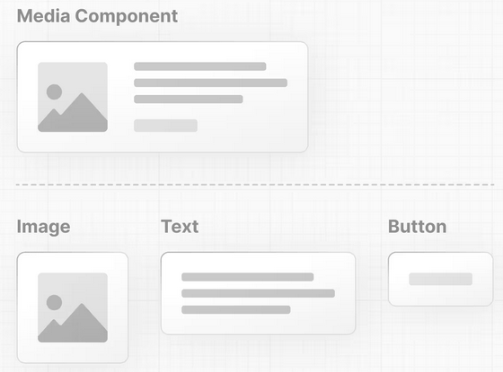
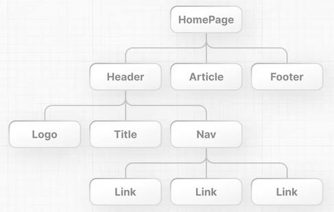
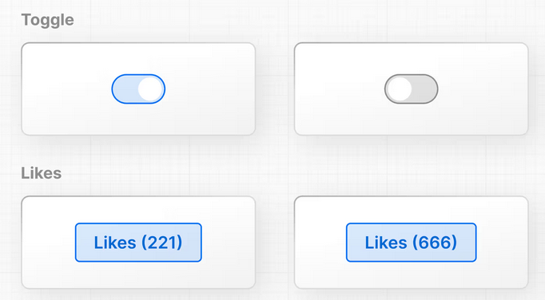
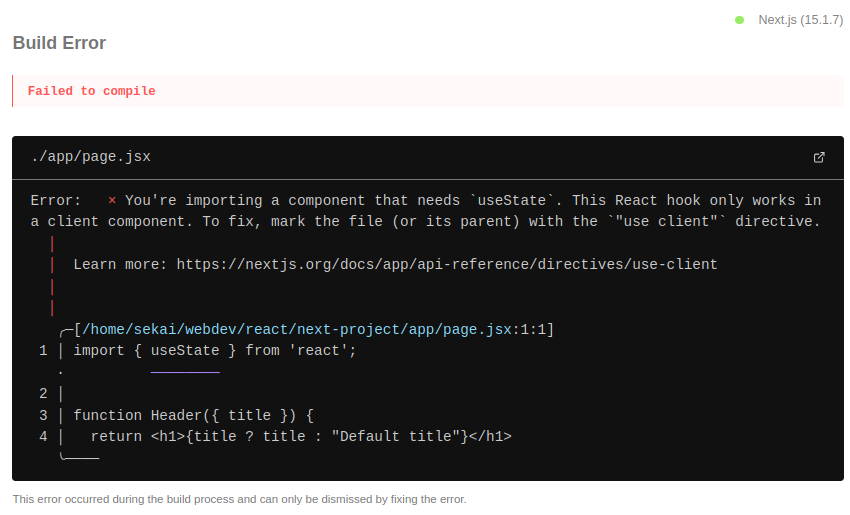
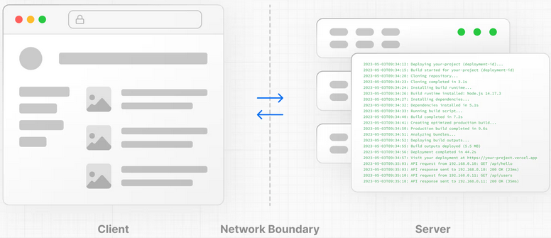
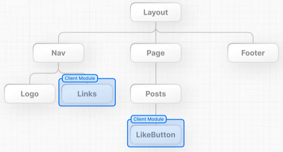

# Chapter 1: About

Building blocks of a web application:
* User Interface - how users will consume and interact with your application.
* Routing -- how users navigate between different parts of your application.
* Data Fetching -- where your data lives and how to get it.
* Rendering -- when and where you render static or dynamic content.
* Integrations -- what third-party services you use (for CMS, auth, payments, etc.) and how you connect to them.
* and others...

React is a JavaScript library for building interactive user interfaces. For the other building blocks, React is relatively unopinionated.

Next.js is a React framework that gives you building blocks to create web applications.

By framework, we mean Next.js handles the tooling and configuration needed for React, and provides additional structure, features, and optimizations for your application.

You can use React to build your UI, then incrementally adopt Next.js features to solve common application requirements such as routing, data fetching, and caching.

# Chapter 2: Rendering UI's

Nothing to learn, really.

# Chapter 3: Updating UI with JS

When it comes to building user interfaces, a declarative approach is often preferred because it can speed up the development process. Instead of having to write DOM methods, it would be helpful if developers were able to declare what they want to show.

React is a declarative library.

As a developer, you can tell React what you want to happen to the user interface, and React will figure out the steps of how to update the DOM on your behalf.

# Chapter 4: Getting started with React

To use React in your newly created project, load two React scripts from an external website called unpkg.com.
```html
<script src="https://unpkg.com/react@18/umd/react.development.js"></script>
<script src="https://unpkg.com/react-dom@18/umd/react-dom.development.js"></script>
```

```js
const app = document.getElementById('app');
const root = ReactDOM.createRoot(app);
root.render(<h1>Develop. Preview. Ship.</h1>);
```

If you try to run this code in the browser, you will get a syntax error.
This is because `<h1>...</h1>` is not valid Javascript. This piece of code is JSX.

## What is JSX?

JSX is a syntax extension for JavaScript that allows you to describe your UI in a familiar HTML-like syntax.

Browsers don't understand JSX. You'll need a JavaScript compiler, such as a Babel, to transform your JSX code into regular JavaScript.

### Adding Babel to your project

To add Babel to your project, copy and paste the following script in your `index.html` file.

You also need to inform Babel what code to transform by changing the script type to `type=text/jsx`.
```html
<script src="https://unpkg.com/@babel/standalone/babel.min.js"></script>
<script type="text/jsx">
```

We generated a `h1` element only with the lines:
```js
const root = ReactDOM.createRoot(app);
root.render(<h1>Develop. Preview. Ship.</h1>);
```

And this is exactly what React does, it's a library that contains reusable snippets of code that perform tasks on your behalf - in this case, updating the UI.


# Chapter 5: Building UI with Components

## Components

User interfaces can be broken down into smaller building blocks called **components**.



### Creating components

A component is a function that returns UI elements.

Inside the return statement of the function, you can write JSX:
```js
<script type="text/jsx">
  const app = document.getElementById("app")

  function header() {
     return (<h1>Develop. Preview. Ship.</h1>)
   }

  const root = ReactDOM.createRoot(app);
  root.render(header);
</script>
```

If you try to run the code above in your browser, you'll get an error. To get this to work, there are two things you have to do:

1. React components should be capitalized to distinguish them from plain HTML and JavaScript:
```js
function Header() {
  return <h1>Develop. Preview. Ship.</h1>;
}

const root = ReactDOM.createRoot(app);
// Capitalize the React Component
root.render(Header);
```

2. you use React components the same way you'd use regular HTML tags, with angle brackets `<>`:
```js
function Header() {
  return <h1>Develop. Preview. Ship.</h1>;
}

const root = ReactDOM.createRoot(app);
root.render(<Header />);
```

**WARNING: You are using the in-browser Babel transformer. Be sure to precompile your scripts for production - https://babeljs.io/docs/setup/.**

You can nest React components inside each other like you would regular HTML elements.

Then nest the `<Header>` component inside the new `<HomePage>` component.



In your project, since <HomePage> is now your top-level component, you can pass it to the root.render() method:
```js
function Header() {
  return <h1>Develop. Preview. Ship.</h1>;
}

function HomePage() {
  return (
    <div>
      <Header />
    </div>
  );
}

const root = ReactDOM.createRoot(app);
root.render(<HomePage />);
```

# Chapter 6: Displaying data with props

Regular HTML elements have attributes that you can use to pass pieces of information that change the behavior of those elements. For example, changing the src attribute of an  element changes the image that is shown.

Similar to a JavaScript function, you can design components that accept custom arguments (or props) that change the component's behavior or what is visibly shown when it's rendered to the screen. Then, you can pass down these props from parent components to child components.
```js
function HomePage() {
  return (
    <div>
      <Header title="React" />
    </div>
  );
}
```

The props is is an object, and you can use object destructuring to explicitly name the values of props inside your function parameters
```js
function Header({ title }) {
  console.log(title);
  return <h1>title</h1>;
}
```

If you open your file in the browser, you will see that it is displaying the actual word "title". This is because React thinks you're intending to render a plain text string to the DOM.

You need a way to tell React that this is a JavaScript variable.

## Using variables in JSX

To use the `title` prop, add curly braces `{}`. These are a special JSX syntax that allows you to write regular JavaScript directly inside your JSX markup.

You can think of curly braces as a way to enter "JavaScript land" while you are in "JSX land". You can add any **JavaScript expression** (something that evaluates to a single value) inside curly braces. For example:

1. An **object property** with dot notation:
```js
function Header(props) {
  return <h1>{props.title}</h1>;
}
```

2. A **template literal**:
```js
function Header({ title }) {
  return <h1>{`Cool ${title}`}</h1>;
}
```

3. The **returned value of a function**:
```js
function createTitle(title) {
  if (title) {
    return title;
  } else {
    return 'Default title';
  }
}

function Header({ title }) {
  return <h1>{createTitle(title)}</h1>;
}
```

4. Or **ternary operators**:
```js
function Header({ title }) {
  return <h1>{title ? title : 'Default Title'}</h1>;
}
```

You can now pass any string to your title prop, or, if you used the ternary operator, you could even not pass a title prop at all, since you've accounted for the default case in your component:
```js
function Header({ title }) {
  return <h1>{title ? title : 'Default title'}</h1>;
}

function HomePage() {
  return (
    <div>
      <Header />
    </div>
  );
}
```

Your component now accepts a generic title prop which you can reuse in different parts of your application. All you need to do is change the title string:
```js
function HomePage() {
  return (
    <div>
      <Header title="React" />
      <Header title="A new title" />
    </div>
  );
}
```

## Iteraring through lists

It's common to have data that you need to show as a list. You can use array methods to manipulate your data and generate UI elements that are identical in style but hold different pieces of information.

Add the following array of names to your `HomePage` component. You can then use the `array.map()` method to iterate over the array and use an arrow function to map a name to a list item:
```js
function HomePage() {
  const names = ['Ada Lovelace', 'Grace Hopper', 'Margaret Hamilton'];

  return (
    <div>
      <Header title="Develop. Preview. Ship." />
      <ul>
        {names.map((name) => (
          {name}
        ))}
      </ul>
    </div>
  );
}
```

If you run this code, React will give us a warning about a missing `key` prop. This is because React needs something to uniquely identify items in an array so it knows which elements to update in the DOM.

You can use the names for now since they are currently unique, but it's recommended to use something guaranteed to be unique, like an item ID.
```js
function HomePage() {
  const names = ['Ada Lovelace', 'Grace Hopper', 'Margaret Hamilton'];

  return (
    <div>
      <Header title="Develop. Preview. Ship." />
      <ul>
        {names.map((name) => (
          <li key={name}>{name}
        ))}
      </ul>
    </div>
  );
}
```

# Chapter 7: Adding interactivity with state

Let's explore how React helps us add interactivity with **state** and **event handlers**.

As an example, let's create a "Like" button inside your `HomePage` component. First, add a button element inside the `return()` statement:
```js
function HomePage() {
  const names = ['Ada Lovelace', 'Grace Hopper', 'Margaret Hamilton'];

  return (
    <div>
      <Header title="Develop. Preview. Ship." />
      <ul>
        {names.map((name) => (
          <li key={name}>{name}
        ))}
      </ul>
      <button>Like</button>
    </div>
  );
}
```

To make the button do something when clicked, you can use the `onClick` event:
```js
function HomePage() {
  // ...
  return (
    <div>
      {/* ... */}
      <button onClick={}>Like</button>
    </div>
  );
}
```

In React, **event names are camelCased**. The `onClick` event is one of many possible events you can use to respond to user interaction. For example, you can use `onChange` for input fields or `onSubmit` for forms.

## Handling events

You can define a function to "handle" events whenever they are triggered. Create a function before the return statement called `handleClick()`. Then, you can call the `handleClick` function when the `onClick` event is triggered:
```js
function HomePage() {
  // 	...
  function handleClick() {
    console.log('increment like count');
  }

  return (
    <div>
      {/* ... */}
      <button onClick={handleClick}>Like</button>
    </div>
  );
}
```

## States and hooks

React has a set of functions called hooks. Hooks allow you to add additional logic such as state to your components. You can think of state as any information in your UI that changes over time, usually triggered by user interaction.



You can use state to store and increment the number of times a user has clicked the "Like" button. In fact, the React hook used to manage state is called: `useState()`

Add `useState()` to your project. It **returns an array**, and you can access and use those array values inside your component using **array destructuring**.

The first item in the array is the state `value`, which you can name anything. It's recommended to name it something descriptive => `likes`.

The second item in the array is a function to update the `value`. You can name the update function anything, but it's common to prefix it with `set` followed by the name of the state variable you're updating => `setLikes`.

You can also take the opportunity to add the initial value of your `likes` state to `0`.

Finally, you can call your state updater function, `setLikes` in your `HomePage` component, let's add it inside the `handleClick()` function you previously defined:
```js
function HomePage() {
  // ...
  const [likes, setLikes] = React.useState(0);

  function handleClick() {
    setLikes(likes + 1);
  }

  return (
    <div>
      {/* ... */}
      <button onClick={handleClick}>Likes ({likes})</button>
    </div>
  );
}
```

Clicking the button will now call the `handleClick` function, which calls the `setLikes` state updater function with a single argument of the current number of `likes + 1`.

**Note**: Unlike props which are passed to components as the first function parameter, the state is initiated and stored within a component. You can pass the state information to children components as props, but the logic for updating the state should be kept within the component where state was initially created.

## Managing state

This was only an introduction to state, and there's more you can learn about managing state and data flow in your React applications. To learn more, we recommend you go through the <a href="https://react.dev/learn/adding-interactivity" rel="noopener noreferrer nofollow" target="_blank">Adding Interactivity</a> and <a href="https://react.dev/learn/managing-state" rel="noopener noreferrer nofollow" target="_blank">Managing State</a> sections in the React documentation.

## Additional resources

<ul>
<a href="https://react.dev/learn/state-a-components-memory" rel="noopener noreferrer nofollow" target="_blank">State: A component's memory</a>
<a href="https://react.dev/learn/state-a-components-memory#meet-your-first-hook" rel="noopener noreferrer nofollow" target="_blank">Meet your first hook
<a href="https://react.dev/learn/responding-to-events" rel="noopener noreferrer nofollow" target="_blank">Responding to Events</a>
</ul>


# Chapter 8: From React to Next.js

In the last few chapters, you were introduced to three essential React concepts: **components, props, and state**. Having a strong foundation in these will help you get started building React applications.

While React excels at building UI, it does take some work to independently build that UI into a fully functioning scalable application. There are also newer React features, like Server and Client Components, that require a framework. The good news is that Next.js handles much of the setup and configuration and has additional features to help you build React applications.

Next, we'll migrate the example from React to Next.js, discuss how Next.js works, and introduce you to the differences between Server and Client Components.

# Chapter 9: Installing Next.js

When you use Next.js in your project, you do not need to load the `react` and `react-dom` scripts from unpkg.com anymore.

To do so, create a new file in the same directory as your `index.html` file, called `package.json` with an empty object `{}`.
```json
// empty package.json
{}
```

In your terminal, run the following command in the root of your project:
```bash
npm install react@latest react-dom@latest next@latest
```

Once the installation is complete, you should be able to see your project dependencies listed inside your `package.json` file:
```json
// package.json
{
  "dependencies": {
    "next": "^15.1.7",
    "react": "^19.0.0",
    "react-dom": "^19.0.0"
  }
}
```

You will also notice a new file called `package-lock.json` file that contains detailed information about the exact versions of each package.

Jumping back to the `index.html` file, we had:
```html
<!DOCTYPE html>
<head>
  <meta charset="UTF-8">
  <meta name="viewport" content="width=device-width, initial-scale=1.0">
  <title>Document</title>
</head>
  <script src="react.development.js"></script>
  <script src="react-dom.development.js"></script>
  <script src="babel.min.js"></script>
  <script type="text/jsx">
    const app = document.getElementById("app")

    function Header({ title }) {
      return <h1>{title ? title : "Default title"}</h1>
    }

    function HomePage() {
      const names = ['Ada Lovelace', 'Grace Hopper', 'Margaret Hamilton'];

      const [likes, setLikes] = React.useState(0);

      function handleClick() {
        setLikes(likes + 1);
      }

      return (
        <div>
          <Header title="Develop. Preview. Ship." />
          <ul>
            {names.map((name) => (
              <li key={name}>{name}
            ))}
          </ul>
          <button onClick={handleClick}>Like({likes})</button>
        </div>
      );
    }

    const root = ReactDOM.createRoot(app);
    root.render(<HomePage />);
  </script>
```

Now, you can delete the following code:
1. The `<html>` and `<body>` tags.
2. The `<div>` element with the `id` of `app`.
3. The `react` and `react-dom` scripts since you've installed them with NPM.
4. The `Babel` script because Next.js has a compiler that transforms JSX into valid JavaScript browsers can understand.
5. The `<script type="text/jsx">` tag.
6. The `document.getElementById()` and `ReactDom.createRoot()` methods.
7. The `React.` part of the `React.useState(0)` function

After deleting the lines above, add the following import to the top of your file:
```js
// index.html
import { useState } from 'react';
```

Your code should look like this:
```jsx
// index.html
import { useState } from 'react';

function Header({ title }) {
  return <h1>{title ? title : 'Default title'}</h1>;
}

function HomePage() {
  const names = ['Ada Lovelace', 'Grace Hopper', 'Margaret Hamilton'];

  const [likes, setLikes] = useState(0);

  function handleClick() {
    setLikes(likes + 1);
  }

  return (
    <div>
      <Header title="Develop. Preview. Ship." />
      <ul>
        {names.map((name) => (
          <li key={name}>{name}
        ))}
      </ul>

      <button onClick={handleClick}>Like ({likes})</button>
    </div>
  );
}
```

The only code left in the HTML file is JSX, so you can change the file type from `.html` to `.js` or `.jsx`.

## Creating your first page

Next.js uses file-system routing. This means that instead of using code to define the routes of your application, you can use folders and files.

Here's how you can create your first page in Next.js:
1. Create a new folder called <a href="https://nextjs.org/docs/app/building-your-application/routing#the-app-router" rel="noopener noreferrer nofollow" target="_blank">app</a> and move the `index.js` file inside it.
2. Rename your `index.js` file to `page.js`. This will be the main page of your application.
3. Add `export default` to your `<HomePage>` component to help Next.js distinguish which component to render as the main component of the page.

## Running the development server

Next, let's run your development server so you can see the changes in your new page while developing. Add a `"next dev"` script to your `package.json` file:
```json
{
  "scripts": {
    "dev": "next dev"
  },
  "dependencies": {
    "next": "^15.1.7",
    "react": "^19.0.0",
    "react-dom": "^19.0.0"
  }
}
```

Check what happens by running `npm run dev` in your terminal. You'll notice two things:

1. When you navigate to http://localhost:3000, you should see the following error:


This is because Next.js uses React Server Components, a new feature that allows React to render on the server. Server Components don't support `useState`, so you'll need to use a Client Component instead.

In the next chapter, we'll discuss the main differences between Server and Client Components and fix this error.

2. A new file called `layout.js` was automatically created inside the app folder. This is the main layout of your application. You can use it to add UI elements that are shared across all pages (e.g. navigation, footer, etc).
```js
// app/layout.js
export const metadata = {
  title: 'Next.js',
  description: 'Generated by Next.js',
};

export default function RootLayout({ children }) {
  return (
    <html lang="en">
      <body>{children}</body>
    </html>
  );
}
```


### Additional reading

* <a href="https://nextjs.org/docs/app/building-your-application/routing" rel="noopener noreferrer nofollow" target="_blank">Next.js Routing Fundamentals</a>
* <a href="https://nextjs.org/docs/app/building-your-application/routing/defining-routes" rel="noopener noreferrer nofollow" target="_blank">Defining Routes</a>
* <a href="https://nextjs.org/docs/app/building-your-application/routing/pages-and-layouts" rel="noopener noreferrer nofollow" target="_blank">Pages and Layouts</a>


# Chapter 10: Server and Client Components

To understand how Server and Client Components work, it's helpful to be familiar with two foundational web concepts:
* The environments your application code can be executed in: the server and the client.
* The network boundary that separates server and client code.

In the context of web applications:


Each environment has its own set of capabilities and constraints. For example, by moving rendering and data fetching to the server, you can reduce the amount of code sent to the client, which can improve your application's performance. But, as you learned earlier, to make your UI interactive, you need to update the DOM on the client.

## Network Boundary

The **Network Boundary** is a conceptual line that separates the different environments.

In React, you choose where to place the network boundary in your component tree. For example, you can fetch data and render a user's posts on the server (using Server Components), then render the interactive LikeButton for each post on the client (using Client Components).

Similarly, you can create a `Nav` component that is rendered on the server and shared across pages, but if you want to show an active state for links, you can render the list of `Links` on the client.


Behind the scenes, the components are split into two module graphs. The **server module graph (or tree)** contains all the Server Components that are rendered on the server, and the **client module graph (or tree)** contains all Client Components.

After Server Components are rendered, a special data format called the **React Server Component Payload (RSC)** is sent to the client. The RSC payload contains:
1. The rendered result of Server Components.
2. Placeholders (or holes) for where Client Components should be rendered and references to their JavaScript files.

React uses this information to consolidate the Server and Client Components and update the DOM on the client.

### Using client components

Next.js uses Server Components by default - this is to improve your application's performance and means you don't have to take additional steps to adopt them.

Looking back at the error in your browser, Next.js is warning you that you're trying to `useState` inside a Server Component. You can fix this by moving the interactive "Like" button to a Client Component.

Create a new file called `like-button.js` inside the `app` folder that exports a `LikeButton` component:
```js
// ./app/like-button.js
export default function LikeButton() {}
```

Move the `<button>` element and the `handleClick()` function from `page.js` to your new `LikeButton` component:
```js
// ./app/like-button.js
export default function LikeButton() {
  function handleClick() {
    setLikes(likes + 1);
  }

  return <button onClick={handleClick}>Like ({likes})</button>;
}
```

Next, move the `likes` state and the import:
```js
// ./app/like-button.js
import { useState } from 'react';

export default function LikeButton() {
  const [likes, setLikes] = useState(0);

  function handleClick() {
    setLikes(likes + 1);
  }

  return <button onClick={handleClick}>Like ({likes})</button>;
}
```

Now, to make the `LikeButton` a Client Component, add the React `'use client'` directive at the top of the file. This tells React to render the component on the client.
```js
'use client';

import { useState } from 'react';

export default function LikeButton() {
  const [likes, setLikes] = useState(0);

  function handleClick() {
    setLikes(likes + 1);
  }

  return <button onClick={handleClick}>Like ({likes})</button>;
}
```

Back in your `page.js` file, import the `LikeButton` component into your page:
```js
// /app/page.jsx
import LikeButton from './like-button';

function Header({ title }) {
  return <h1>{title ? title : 'Default title'}</h1>;
}

export default function HomePage() {
  const names = ['Ada Lovelace', 'Grace Hopper', 'Margaret Hamilton'];

  return (
    <div>
      <Header title="Develop. Preview. Ship." />
      <ul>
        {names.map((name) => (
          <li key={name}>{name}
        ))}
      </ul>
      <LikeButton />
    </div>
  );
}
```

Save both files and view your app in the browser. Now that there are no errors, once you make changes and save, you should notice the browser automatically updates to reflect the change.

This feature is called Fast Refresh. It gives you instantaneous feedback on any edits you make and comes pre-configured with Next.js.

## Summary

To recap, you learned about the server and client environments and when to use each. You also learned that Next.js uses React Server Components by default to improve performance, and how you can opt into Client Components to smaller parts of your UI interactive.

## Additional reading

* <a href="https://nextjs.org/docs/app/building-your-application/rendering/server-components" rel="noopener noreferrer nofollow" target="_blank">Server Components Docs</a>
* <a href="https://nextjs.org/docs/app/building-your-application/rendering/client-components" rel="noopener noreferrer nofollow" target="_blank">Client Component Docs</a>
* <a href="https://nextjs.org/docs/app/building-your-application/rendering/composition-patterns" rel="noopener noreferrer nofollow" target="_blank">Composition Patterns</a>
* <a href="https://react.dev/reference/react/use-client" rel="noopener noreferrer nofollow" target="_blank">The "use client" Directive</a>
* <a href="https://react.dev/reference/react/use-server" rel="noopener noreferrer nofollow" target="_blank">The "use server" Directive</a>

# Chapter 11: Next Steps

## What's next?

### Continue learning React

Over the years, many courses, videos, and articles have been created to help developers learn React. While it's hard to recommend resources that will fit your learning style, one invaluable reference is the <a href="https://react.dev/" rel="noopener noreferrer nofollow" target="_blank">React Documentation</a> which contains interactive sandboxes to help you practice the topics.

### Learn Next.js by building a dashboard app

Continue learning Next.js by <a href="https://nextjs.org/learn/dashboard-app" rel="noopener noreferrer nofollow" target="_blank">creating a dashboard app</a> - this course will introduce you to the main Next.js features and get you practicing by building a more complex project.

